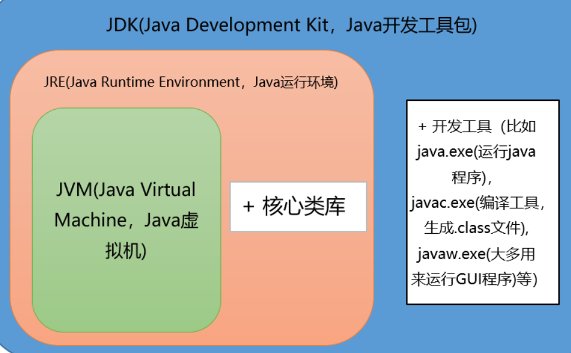
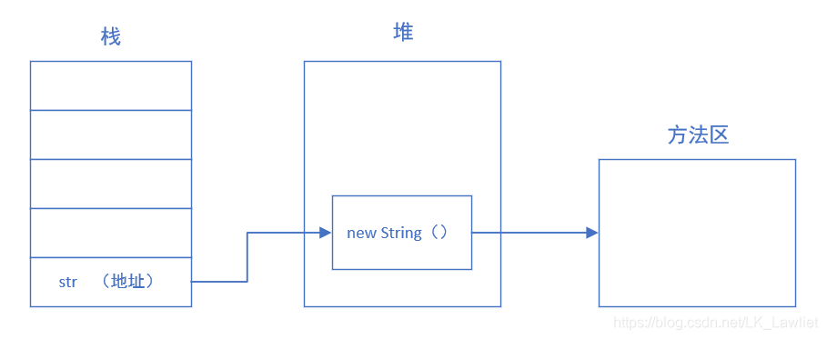
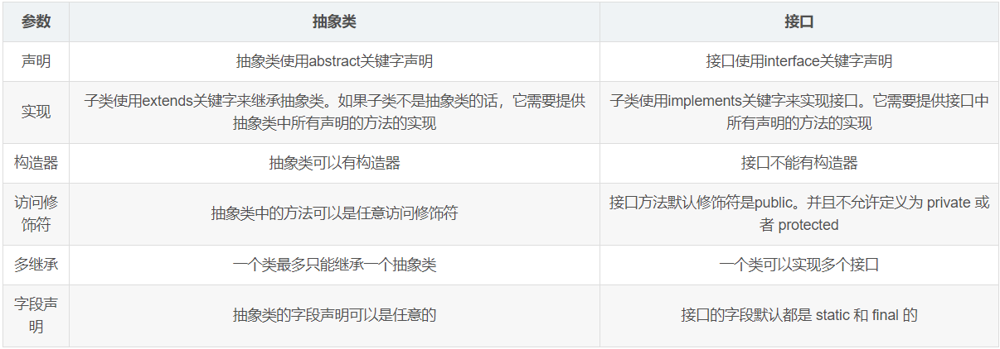
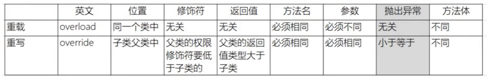
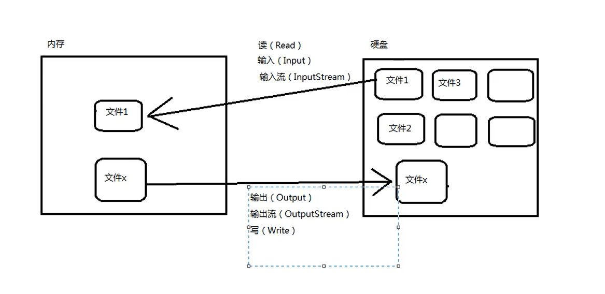

# 1、Java概述

### 1.1、jdk1.5后的三大版本

##### 1.1.1、JavaSE

标准版，允许开发部署在桌面、服务器、嵌入式环境、实时环境的Java程序

##### 1.1.2、JavaEE

企业办，企业版本帮助开发和部署可移植、健壮、可伸缩且安全的服务器端Java 应用程序。Java EE 是在 Java SE 的基础上构建的，它提供 Web 服务、组件模型、管理和通信 API，可以用来实现企业级的面向服务体系结构（service-oriented architecture，SOA）和 Web2.0应用程序。2018年2月，Eclipse 宣布正式将 JavaEE 更名为 JakartaEE

##### 1.1.3、JavaME

微型版，为在移动设备和嵌入式设备（比如手机、PDA、电视机顶盒和打印机）上运行的应用程序提供一个健壮且灵活的环境

### 1.2、JRE、JVM、JDK关系



##### 1.2.1、JVM

Java Virtual Machine Java虚拟机

Java程序运行在虚拟机上，不同平台有不通虚拟机，因此实现跨平台

##### 1.2.2、JRE

Java Runtime Environment 包括Java虚拟机和程序所需要的核心类库

如：基本数据类型、基本数学函数、字符串处理、多线程、异常

##### 1.2.3、JDK

Java Development Kit 开发工具包

包含了Java的开发工具，也包括了JRE

### 1.3、跨平台原理

- 一次编译，可在多平台运行
- Java程序运行在虚拟机，不同平台有不同虚拟机

### 1.4、Java语言特典

 简单易学，面向对象，平台无关性，支持网络编程，多线程，安全性，健壮性

### 1.5、字节码（.class）

##### 1.5.1、字节码好处

- 解决传统解释型语言效率低的问题同时保留解释型语言可移植的特点；
- 字节码不专对一种特定的机器，Java程序无需重新编译即可运行在不同计算机上；

##### 1.5.2、编译器和解释器

- 编译器：源程序编译成字节码
- 解释器：字节码翻译成特定机器上的机器码

### 1.6、Java和C++区别

- 都是面向对象语言，支持封装、继承和多态
- Java不提供指针直接访问内存，程序内存更安全
- Java类单继承，C++多继承；Java接口多继承
- Java有自动内存管理机制，不需要程序员手动释放

### 1.7、Oracle JDK 和 OpenJDK 

1. Oracle JDK版本将每三年发布一次，而OpenJDK版本每三个月发布一次；

2. OpenJDK 是一个参考模型并且是完全开源的，而Oracle JDK是OpenJDK的一个实现，并不是完全开源的；

3. Oracle JDK 比 OpenJDK 更稳定。OpenJDK和Oracle JDK的代码几乎相同，但Oracle JDK有更多的类和一些错误修复。因此，如果您想开发企业/商业软件，我建议您选择Oracle JDK，因为它经过了彻底的测试和稳定。某些情况下，有些人提到在使用OpenJDK 可能会遇到了许多应用程序崩溃的问题，但是，只需切换到Oracle JDK就可以解决问题；

4. 在响应性和JVM性能方面，Oracle JDK与OpenJDK相比提供了更好的性能；

5. Oracle JDK不会为即将发布的版本提供长期支持，用户每次都必须通过更新到最新版本获得支持来获取最新版本；

6. Oracle JDK根据二进制代码许可协议获得许可，而OpenJDK根据GPL v2许可获得许可。

# 2、基础语法

### 2.1数据类型


##### 2.1.1、基本数据类型

- 数值型

​		整数类型（byte，short，int，long）

​		浮点类型（float，double）

- 字符型（char）

- 布尔型（boolean）

##### 2.1.2、引用类型

- 类（class）

- 接口（interface）

- 数组（[ ]）

##### 2.1.3、float f=3.4;是否正确

双精度数：double d = 3.4；

单精度数：float f = 3.4F;

##### 2.1.4、Math.round

四舍五入的原理是在参数上加 0.5 然后进行下取整

##### 2.1.5、数据类型转换

- 自动转换：小转大
- 强制转换：大转小

byte->short->int->long->float->double

char->byte[]

String->char[]...

##### 2.1.6、short s1 = 1; s1 = s1 + 1;有错吗?short s1 = 1; s1 += 1;有错吗

- 对于 short s1 = 1; s1 = s1 + 1;由于 1 是 int 类型，因此 s1+1 运算结果也是 int型，需要强制转换类型才能赋值给 short 型。

- 而 short s1 = 1; s1 += 1;可以正确编译，因为 s1+= 1;相当于 s1 = (short(s1 + 1);其中有隐含的强制类型转换。

##### 2.1.7、栈、堆和方法区



- 栈

  - Java栈的区域很小，只有1M，特点是存取速度很快，所以在stack中存放的都是快速执行的任务，基本数据类型的数据，和对象的引用（reference）。

- 堆

  - 类的对象放在heap（堆）中，所有的类对象都是通过new方法创建，创建后，在stack（栈）会创建类对象的引用（内存地址）；堆是垃圾收集器管理的主要区域。

- 方法区

  - 方法区用于存储已经被JVM加载的类信息、常量、静态变量、JIT(Just-In-Time)即时编译器编译后的代码等数据；

  - 程序中的字面量（literal）如直接书写的100、"hello"和常量都是放在常量池中；

  - 常量池是方法区的一部分。

### 2.2、编码

- Java采用Unicode编码标准，它为每一个字符制定了唯一的数值，跨语言、跨平台使用

### 2.3、注释

- 单行注释：//
- 多行注释：/* */
- 文档注释：/** */

### 2.4、访问修饰符


- private : 在同一类内可见。使用对象：变量、方法。 注意：不能修饰类（外部类）
- default (即缺省，什么也不写，不使用任何关键字）: 在同一包内可见，不使用任何修饰符。使用对象：类、接口、变量、方法。
- protected : 对同一包内的类和所有子类可见。使用对象：变量、方法。 注意：不能修饰类（外部类）。
- public : 对所有类可见。使用对象：类、接口、变量、方法

### 2.5、运算符

##### 2.5.1、&

两种用法：按位与，逻辑与

##### 2.5.2、&&（短路与运算）

- 要求运算符左右两端的布尔值都是true 整个表达式的值才是 true

### 2.6、关键字

##### 2.6.1、goto

- goto是Java中的保留字，目前版本没有使用

##### 2.6.2、final用于修饰类、属性和方法

- 被其修饰的类不可被继承
- 被其修饰的方法不可被重写
-  被其修饰的变量，引用不可改变，引用的内容可以改变

##### 2.6.3、this关键字

this是自身的一个对象，可以理解为指向对象本身的一个指针

1. 普通的直接引用，this相当于是指向当前对象本身。

2. 形参与成员名字重名，用this来区分

   ```java
   public Person(String name, int age) {
       this.name = name;
       this.age = age;
   }
   ```

3. 引用本类的构造函数

   ```
   class Person{
       private String name;
       private int age;
       
       public Person() {
       }
    
       public Person(String name) {
           this.name = name;
       }
       public Person(String name, int age) {
           this(name);
           this.age = age;
       }
   }
   ```

##### 2.6.4、super关键字

super可以理解为是指向离自己最近的超（父）类对象的一个指针

1. 普通的直接引用：可以用super.xxx来引用父类的成员

2. 子类中的成员变量或方法与父类中的成员变量或方法同名时，用super进行区分

   ```java
   public void getInfo(){
           System.out.println(this.name);      //Child
           System.out.println(super.name);     //Father
       }
   ```

3. 引用父类构造函数

   ```java
    public Student(String name, String name1) {
           super(name);
           this.name = name1;
       }
   ```

##### 2.6.5、final finally finalize

1、final 

- 修饰类、方法、变量

2、finally 

- try、catch、finally

3、finalize

- 调用System.gc()方法时，垃圾回收器调用其回收垃圾

### 2.7、static

##### 2.7.1、static注意事项

- 静态只能访问静态
- fe非静态可以访问静态和非静态

##### 2.7.2、static意义

- 创建独立于具体对象的域变量或方法，即使没创建对象也能调用
- 形成静态代码块优惠呀程序；

##### 2.7.3、static独特之处

1. 被static修饰的变量或者方法是独立于该类的任何对象，也就是说，这些变量和方法不属于任何一个实例对象，而是被类的实例对象所共享。
2. 在该类被第一次加载的时候，就会去加载被static修饰的部分，而且只在类第一次使用时加载并进行初始化，注意这是第一次用就要初始化，后面根据需要是可以再次赋值的。
3. static变量值在类加载的时候分配空间，以后创建类对象的时候不会重新分配。赋值的话，是可以任意赋值的！
4. **被static修饰的变量或者方法是优先于对象存在的**，也就是说当一个类加载完毕之后，即便没有创建对象，也可以去访问。

##### 2.7.4、static应用场景

**某个成员变量是被所有对象所共享的，那么这个成员变量就应该定义为静态变量**，如：

1. 修饰成员变量 
2. 修饰成员方法
3. 静态代码块 
4. 修饰类【只能修饰内部类也就是静态内部类】
5. 静态导包

### 2.8、流程控制语句

##### 2.8.1、break ,continue ,return 的区别及作用

- break 跳出总上一层循环，不再执行循环(结束当前的循环体)
- continue 跳出本次循环，继续执行下次循环(结束正在执行的循环 进入下一个循环条件)
- return 程序返回，不再执行下面的代码(结束当前的方法 直接返回)

##### 2.8.2、如何跳出当前的多重嵌套循环

```java
public static void main(String[] args) {
    ok:
    for (int i = 0; i < 10; i++) {
        for (int j = 0; j < 10; j++) {
            System.out.println("i=" + i + ",j=" + j);
            if (j == 5) {
                break ok;
            }

        }
    }
}
```

# 3、面向对象

### 3.1、面向对象和面向过程

##### 3.1.1、面向过程

- 优点：

  性能比面向对象高

- 缺点：

  不易维护、复用、扩展

##### 3.1.2、面向对象

- 优点：

  易维护、复用、扩展；由于面向对象封装、继承、多态的特点，可以设计出低耦合的系统

- 缺点：

  性能比面向过程低；类调用时需要实例化，比较耗费资源

### 3.2、面向对象三大特征

#### 三大特征

##### 3.2.1、封装

- 类的属性私有化，对外暴露访问属性的方法

##### 3.2.2、继承

以已存在的类作为基类创建新的类（不可选择继承）

1. 子类拥有父类非 private 的属性和方法。
2. 子类可以拥有自己属性和方法，即子类可以对父类进行扩展。
3. 子类可以用自己的方式实现父类的方法。

##### 3.2.3、多态

父类或接口定义的引用变量可以子类或具体实现类的实例对象；提高程序扩展性

#### 3.2.4、抽象

- 抽象是对一类对象的共同特征总结出来构造类的过程，包括数据抽象和行为抽象；
- 抽象只关注对象有哪些行为和属性，不关注行为的细节。

#### 3.2.5、实现多态必要条件

- 继承：继承关系的父子类
- 重写：子类重写父类方法，是现实调用子类方法
- 向上转型：子类的引用赋值给父类对象

#### 3.2.6、面向对象五大基本原则

- 单一职责原则
- 开放封闭原则
- 里氏替换原则
- 依赖倒置原则
- 接口分离原则

### 3.3、抽象类与接口

##### 1、抽象类

(1)抽象类可以定义构造器

(2)可以由抽象方法和具体方法

(3)抽象类的成员可以是private、默认、protected、public

(4)抽象类中可以定义成员变量

(5)有抽象方法必须定义为抽象类、抽象类不一定有抽象方法

(6)	抽象类可以有静态方法

(7)一个类只能继承一个抽象类

##### 2、接口

(1)接口不能定义构造器

(2)方法全部是抽象方法

(3)接口中的成员全部是public

(4)接口中定义的成员变量实际上是常量

(5)接口中不能有静态方法

(6)一个类可以实现多个接口

##### 3、何时使用

抽象类侧重与具体既有概念（事物）

接口描述某些事物具有的共同特征（行为）

##### 4、异同

- 相同点：
  - 都不能实例化
  - 位于继承的顶端，用于被继承或实现
  - 都包含抽象方法，子类覆写这些方法

- 不同点：
  - 

### 3.4、变量和方法

#### 1、变量

- 局部变量：类的方法中的变量
  - 只在某个范围内有效
  - 在方法被调用，或者语句被执行的时候存在，存储在栈内存中
  - 当方法调用完，或者语句结束后，就自动释放
  - 没有默认初始值，使用前必须赋值
- 成员变量：方法外部，类内部定义的变量
  - 针对整个类有效
  - 随着对象的创建而存在，随着对象的消失而消失，存储在堆内存中
  - 随着对象的创建而存在，随着对象的消失而消失
  - 有默认初始值

- 使用原则：就近原则，先找局部，没有找全局

#### 2、方法

#### 3.5、内部类

- 成员内部类
- 静态内部类
- 局部内部类
- 匿名内部类
  - 匿名内部类必须继承抽象类或实现接口
  - 不能定义任何静态成员或静态方法
  - 所在方法形成需要被匿名内部类使用，需用final修饰
  - 不能是抽象的，必须实现所有抽象方法

##### 3.5.1、内部类优点

- 实现了多继承
- 内部类可以访问外部类的对象的内容，包括私有数据
- 不被同包下的其他类所见，封装性
- 方便定义回调

##### 3.5.2、内部类应用场景

- 一些多算法场合
- 非面向对象的语句块
- 适当使用内部类，使代码灵活有扩展性
- 当某个类除了它的外部类，不再被其他的类使用时

##### 3.5.3、局部内部类和匿名内部类访问局部变量的时候，为什么变量必须要加上final？

生命周期不一致

局部变量存放在栈中，方法执行结束，非final局部变量被销毁，但内部类对变量的引用依然存在

### 3.5、重写和重载



##### 1、重写

1.1、参数列表、返回值一致

1.2、构造方法不能重写，final、static修饰的方法不可被重写，static修饰的方法可被再次声明

1.3、访问权限不能比父类方法低

1.4、重写的方法可抛出任何非强制异常，不可抛出新的强制异常或范围更广的强制异常

##### 2、重载

2.1、方法名一致，参数列表中参数的顺序、类型、个数不同

2.2、与方法的返回值无关，存在于父类、子类、同类

2.3、可以抛出不同的异常，有不同的修饰符

##### 3、构造器（constructor）是否可被重写（override）

构造器不可继承，不可重写，但可重载

### 3.6、对象相等判断

#### 3.6.1、==和equals（）

- 如果为基础数据类型，==比较数据的值；如果为引用数据类型，==比较数据的地址。
- equals比较数据的值。

#### 3.6.2、hashCode 与 equals

##### 1、hashCode()介绍

hashCode() 的作用是获取哈希码，也称为散列码；它实际上是返回一个int整数。这个哈希码的作用是确定该对象在哈希表中的索引位置。hashCode() 定义在JDK的Object.java中，这就意味着Java中的任何类都包含有hashCode()函数。

##### 2、hashCode()与equals()的相关规定

- 两个对象相等，hashCode相等
- 两个对象相等，两对象分别调用equals返回true
- hashCode相等，对象不一定相等

##### 3、对象的相等与指向他们的引用相等，两者有什么不同

- 对象相等比的是内存中的内容是否相同
- 引用相同比的是指向的地址是否相同

### 3.7、值传递

**Java 语言的方法调用只支持参数的值传递**

- 一个方法不能修改一个基本数据类型的参数（即数值型或布尔型》
- 一个方法可以改变一个对象参数的状态。
- 一个方法不能让对象参数引用一个新的对象。

### 3.8、JAVA包

##### 1、JDK 中常用的包有哪些

- java.lang：这个是系统的基础类；
- java.io：这里面是所有输入输出有关的类，比如文件操作等；
- java.nio：为了完善 io 包中的功能，提高 io 包中性能而写的一个新包；
- java.net：这里面是与网络有关的类；
- java.util：这个是系统辅助类，特别是集合类；
- java.sql：这个是数据库操作的类。

##### 2、import java和javax有什么区别

- 刚开始的时候 JavaAPI 所必需的包是 java 开头的包，javax 当时只是扩展 API 包来说使用。然而随着时间的推移，javax 逐渐的扩展成为 Java API 的组成部分。但是，将扩展从 javax 包移动到 java 包将是太麻烦了，最终会破坏一堆现有的代码。因此，最终决定 javax 包将成为标准API的一部分。
- 所以，实际上java和javax没有区别。这都是一个名字。

# 4、IO流



- 按流向分：输入流、输出流

- 操作单元分：字节流、字符流0

  - 字节流：每次读取(写出)一个字节，当传输的资源文件有中文时，就会出现乱码。

  - 字符流：每次读取(写出)两个字节，有中文时，使用该流就可以正确传输显示中文。

- 流的角色划分：节点流、处理流

##### 4.1、BIO,NIO,AIO 有什么区别?

- BIO：Block IO 同步阻塞式 IO，就是我们平常使用的传统 IO，它的特点是模式简单使用方便，并发处理能力低。、
- NIO：Non IO 同步非阻塞 IO，是传统 IO 的升级，客户端和服务器端通过 Channel（通道）通讯，实现了多路复用。
- AIO：Asynchronous IO 是 NIO 的升级，也叫 NIO2，实现了异步非堵塞 IO ，异步 IO 的操作基于事件和回调机制。

##### 4.2、Files的常用方法

- Files. exists()：检测文件路径是否存在。
- Files. createFile()：创建文件。
- Files. createDirectory()：创建文件夹。
- Files. delete()：删除一个文件或目录。
- Files. copy()：复制文件。
- Files. move()：移动文件。
- Files. size()：查看文件个数。
- Files. read()：读取文件。
- Files. write()：写入文件。

# 5、反射

### 5.1、什么是反射机制

反射机制是在运行状态中，对于任意一个类，都能知道这个类的所有属性和方法；对于一个对象，都能调用它的任意一个属性和方法；这种动态获取信息、动态调用对象的功能称为反对和机制。

### 5.2、静态、动态编译

- 静态编译：在编译时确定类型、绑定对象
- 动态编译：运行时确定类型、绑定对象

### 5.3、反射机制优缺点

- 优点：运行期类型的判断、动态加载类、提高代码灵活度
- 缺点：性能低，反射相当于一系列解释操作，通知JVM要做的事，性能比直接Java代码要慢

### 5.4、反射机制应用场景

反射是框架设计的灵魂。

举例：

1. 我们在使用JDBC连接数据库时使用Class.forName()通过反射加载数据库的驱动程序；
2. Spring框架xml配置模式：
   - 将程序内所有xml或properties配置文件载入内存
   - Java类解析配置文件，得到对应实体类的字节码字符串及相关属性信息
   - 使用反射机制根据字符串获得某个类的实例
   - 动态配置实例的属性

### 5.5、获取反射的三种方法

- 通过new对象实现反射机制 
- 通过路径实现反射机制
- 通过类名实现反射机制

```java
public class Get {
    //获取反射机制三种方式
    public static void main(String[] args) throws ClassNotFoundException {
        //方式一(通过建立对象)
        Student stu = new Student();
        Class classobj1 = stu.getClass();
        System.out.println(classobj1.getName());
        //方式二（所在通过路径-相对路径）
        Class classobj2 = Class.forName("fanshe.Student");
        System.out.println(classobj2.getName());
        //方式三（通过类名）
        Class classobj3 = Student.class;
        System.out.println(classobj3.getName());
    }
}
```

# 6、常用API

## 6.1、String相关

### 6.1.1、字符型常量和字符串常量

- 字符型常量是单引号引起的一个字符，字符串常量是双引号引起的一串字符
- 字符型常量相当于一个整型值，可以参加运算，字符串常量相当于一个地址
- 字符型常量只用一个字节，字符串常量占用若干字节

### 6.1.2、字符串常量池

字符串常量池位于**堆内存**中，专门用来存放字符串常量，可以提高内存使用率，避免开辟多块内存存储相同字符串，在创建字符串时JVM会先检索字符串常量池，如果存在，则直接返回其引用，否则，实例化一个字符串放入常量池并返回其引用。

### 6.1.3、8大基本数据类型

byte、shotr、int、long、boolean、char、float、double

### 6.1.4、String特性

- 不可改变，对其改变相当于创建新常量
- 常量池
- final修饰，不可继承

### 6.1.5、String s = new String(“xyz”);创建了几个字符串对象

两个对象，一个是静态区的"xyz"，一个是用new创建在堆上的对象。

### 6.1.6、在使用 HashMap 的时候，用 String 做 key 有什么好处？

HashMap 内部实现是通过 key 的 hashcode 来确定 value 的存储位置，因为字符串是不可变的，所以当创建字符串时，它的 hashcode 被缓存下来，不需要再次计算，所以相比于其他对象更快。

### 6.1.7、StringBuffer、StringBuilder

- 单线程操作字符串缓冲区 下操作大量数据 = StringBuilder，线程不安全
- 多线程操作字符串缓冲区 下操作大量数据 = StringBuffer，线程安全

## 6.2、包装类

### 6.2.1、包装类型

- 原始类型: boolean，char，byte，short，int，long，float，double
- 包装类型：Boolean，Character，Byte，Short，Integer，Long，Float，Double

### 6.2.2、自动拆箱、装箱

- 装箱：将基本类型用它们的引用类型封装
- 拆箱：将包装类型转换为基本类型

### 6.2.3、Integer a= 127 与 Integer b = 127相等吗

对于对象引用类型：==比较的是对象的内存地址。
对于基本数据类型：==比较的是值。

如果整型字面量的值在-128到127之间，那么自动装箱时不会new新的Integer对象，而是直接引用常量池中的Integer对象

