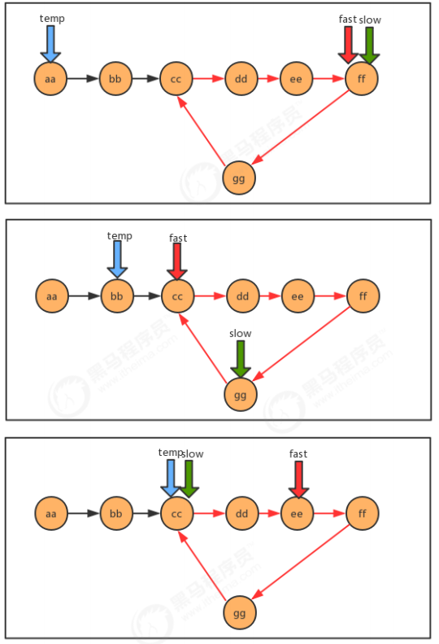
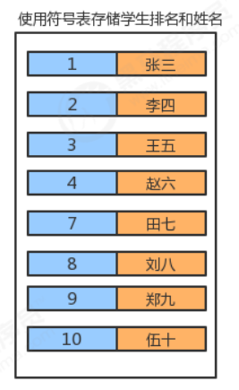

# 一、线性表

## 1.1、顺序表


顺序表是在计算机内存中以数组的形式保存的线性表，线性表的顺序存储是指用一组地址连续的存储单元，依次存 储线性表中的各个元素、使得线性表中再逻辑结构上响铃的数据元素存储在相邻的物理存储单元中，即通过数据元 素物理存储的相邻关系来反映数据元素之间逻辑上的相邻关系。

### 1.1.1、顺序表实现

**顺序表API设计：**


### 1.1.2、顺序表遍历

一般作为容器存储数据，都需要向外部提供遍历的方式，因此我们需要给顺序表提供遍历方式。

在java中，遍历集合的方式一般都是用的是forEach循环，如果想让我们的SequenceList也能支持forEach循环，则 需要做如下操作： 

1. 让SequenceList实现Iterable接口，重写iterator方法；
2. 在SequenceList内部提供一个内部类SIterator,实现Iterator接口，重写hasNext方法和next方法；

```java
public class SequenceList<T> implements Iterable<T> {

	//	线性表数据存储位置
	private T[] eles;
	//	元素个数
	private int N;

	//	构造函数
	public SequenceList(int capacity) {
//		初始化数组
		this.eles = (T[]) new Object[capacity];
//		初始化长度
		this.N = 0;
	}

	//	线性表置空
	public void clear() {
		this.N = 0;
	}

	//	判断当前线性表是否为空
	public boolean isEmpty() {
		return this.N == 0;
	}

	//	获取指定位置的元素
	public T get(int i) {
		if (i < 0 || i >= N) {
			throw new RuntimeException("当前元素不存在！");
		}
		return eles[i];
	}

	//	像线性表添加元素
	public void insert(T t) {
		if (N == eles.length) {
			throw new RuntimeException("当前表已满");
		}
		eles[N++] = t;
	}

	//	指定位置添加元素
	public void insert(int i, T t) {
		if (i == eles.length) {
			throw new RuntimeException("当前表已满");
		}
		if (i < 0 || i > N) {
			throw new RuntimeException("插入的位置不合法");
		}
//		i以后的元素后置
		for (int index = N; index > i; index--) {
			eles[index] = eles[index - 1];
		}
//		插入
		eles[i] = t;
		N++;
	}

	//	删除指定元素并返回
	public T remove(int i) {
		if (i < 0 || i > N - 1) {
			throw new RuntimeException("当前要删除的元素不存在");
		}
//		返回元素
		T current = eles[i];
//		元素前置
		for (int index = i; index < N - 1; index++) {
			eles[index] = eles[index + 1];
		}
//		长度减一
		N--;
		return current;
	}

	//	查询元素第一个索引
	public int indexOf(T t) {
		if (t == null) {
			throw new RuntimeException("查找的元素不合法");
		}
		for (int i = 0; i < N; i++) {
			if (eles[i].equals(t)) {
				return i;
			}
		}
		return -1;
	}

	@Override
	public String toString() {
		return "SequenceList{" +
				"eles=" + Arrays.toString(eles) +
				", N=" + N +
				'}';
	}

	@Override
	public Iterator<T> iterator() {
		return new SequenceListIterator();
	}

	private class SequenceListIterator implements Iterator {
		private int cusor;

		public SequenceListIterator() {
			this.cusor = 0;
		}

		@Override
		public boolean hasNext() {
			return cusor < N;
		}

		@Override
		public Object next() {
			return eles[cusor++];
		}
	}

}
```

### 1.1.3、顺序表容量可变

1. **添加元素时**

   添加元素时，应该检查当前数组的大小是否能容纳新的元素，如果不能容纳，则需要创建新的容量更大的数组，我 们这里创建一个是原数组两倍容量的新数组存储元素。

2. **移除元素时**

    移除元素时，应该检查当前数组的大小是否太大，比如正在用100个容量的数组存储10个元素，这样就会造成内存 空间的浪费，应该创建一个容量更小的数组存储元素。如果我们发现数据元素的数量不足数组容量的1/4，则创建 一个是原数组容量的1/2的新数组存储元素。

```java
//	数组扩容
	public void reSize(int newSize) {
//		定义临时数据指向原数组
		T[] temp = eles;
//		创建新数组
		eles = (T[]) new Object[newSize];
//		拷贝数据
		for (int i = 0; i < N; i++) {
			eles[i] = temp[i];
		}
	}
```

### 1.1.4、顺序便时间复杂度

- get(i):不难看出，不论数据元素量N有多大，只需要一次eles[i]就可以获取到对应的元素，所以时间复杂度为O(1);
-  insert(int i,T t):每一次插入，都需要把i位置后面的元素移动一次，随着元素数量N的增大，移动的元素也越多，时 间复杂为O(n); 
- remove(int i):每一次删除，都需要把i位置后面的元素移动一次，随着数据量N的增大,移动的元素也越多，时间复 杂度为O(n); 
- 由于顺序表的底层由数组实现，数组的长度是固定的，所以在操作的过程中涉及到了容器扩容操作。这样会导致顺 序表在使用过程中的时间复杂度不是线性的，在某些需要扩容的结点处，耗时会突增，尤其是元素越多，这个问题 越明显

### 1.1.5、5 java中ArrayList实现

java中ArrayList集合的底层也是一种顺序表，使用数组实现，同样提供了增删改查以及扩容等功能。

## 1.2、链表

### 1.2.1、单向链表


单向链表是链表的一种，它由多个结点组成，每个结点都由一个数据域和一个指针域组成，数据域用来存储数据， 指针域用来指向其后继结点。链表的头结点的数据域不存储数据，指针域指向第一个真正存储数据的结点。

- 单向链表API设计：


- 单向链表代码实现：

```java
public class LinkList<T> implements Iterable<T> {
	//	记录头节点
	private Node head;
	//	链表长度
	private int N;


	private class Node {
		//		存储数据
		T item;
		//		下一个节点
		Node next;

		public Node(T item, Node next) {
			this.item = item;
			this.next = next;
		}
	}

	public LinkList() {
//		初始化头节点
		this.head = new Node(null, null);
//		初始化元素个数
		this.N = 0;

	}

	//	清空
	public void clear() {
		head.next = null;
		this.N = 0;
	}

	//	获取链表长度
	public int length() {
		return N;
	}

	//	判断链表是否为空
	public boolean isEmpty() {
		return N == 0;
	}

	//	获取指定位置节点
	public T get(int i) {
		Node node = head.next;
		for (int index = 0; index < i; index++) {
			node = node.next;
		}
		return node.item;
	}

	//	插入数据
	public void insert(T t) {
		Node node = head;
//		遍历找到最后一个节点
		while (node.next != null) {
			node = node.next;
		}
//		创建新节点
		Node newNode = new Node(t, null);
//		尾节点指向新节点
		node.next = newNode;
//		长度加一
		N++;
	}

	//	指定位置插入新节点
	public void insert(int i, T t) {
//		找到i位置前一个节点
		Node pre = head;
		for (int index = 0; index < i; index++) {
			pre = pre.next;
		}
//      找到i位置节点
		Node curr = pre.next;

//      创建新节点，指向i节点
		Node newNode = new Node(t, curr);
//      i-1节点指向新节点
		pre.next = newNode;
//		长度加一
		N++;
	}

	//	删除指定位置节点
	public T remove(int i) {
//      找到i-1节点
		Node pre = head;
		for (int index = 0; index < i; index++) {
			pre = pre.next;
		}
//		找到i节点
		Node curr = pre.next;
//		找到i+1节点
		Node nextNode = curr.next;
//		i-1节点指向i+1节点
		pre.next = nextNode;
//		长度减一
		N--;
		return curr.item;
	}

	//	查找元素位置
	public int indexOf(T t) {
		Node node = head;
		for (int index = 0; node.next != null; index++) {
			node = node.next;
			if (node.item.equals(t)) {
				return index;
			}
		}
		return -1;
	}


	@Override
	public Iterator<T> iterator() {
		return new LinkListIterator();
	}

	public class LinkListIterator implements Iterator {

		private Node node;

		public LinkListIterator() {
			this.node = head;
		}

		@Override
		public boolean hasNext() {
			return node.next != null;
		}

		@Override
		public Object next() {
			node = node.next;
			return node.item;
		}
	}

	@Override
	public String toString() {
		return "LinkList{" +
				"head=" + head +
				", N=" + N +
				'}';
	}
}
```

### 1.2.2、双向链表

双向链表也叫双向表，是链表的一种，它由多个结点组成，每个结点都由一个数据域和两个指针域组成，数据域用 来存储数据，其中一个指针域用来指向其后继结点，另一个指针域用来指向前驱结点。链表的头结点的数据域不存 储数据，指向前驱结点的指针域值为null，指向后继结点的指针域指向第一个真正存储数据的结点。


结点API设计


双向链表API设计


双向链表代码

```java
public class TwoWayLinkList<T> implements Iterable<T> {

	//	首节点
	private Node head;
	//	尾节点
	private Node last;
	//	长度
	private int N;

	//	节点类
	private class Node {

		//		数据
		private T item;
		//		前一节点
		private Node pre;
		//		后一节点
		private Node next;

		//		构造函数

		public Node(T item, Node pre, Node next) {
			this.item = item;
			this.pre = pre;
			this.next = next;
		}
	}

	//	构造函数
	public TwoWayLinkList() {
		this.head = new Node(null, null, null);
		this.last = null;
		this.N = 0;
	}

	//	清空链表
	private void clear() {
		this.head.next = null;
		this.head.pre = null;
		this.last = null;
		this.N = 0;
	}

	//	获取链表长度
	public int length() {
		return N;
	}

	//	判空
	public boolean isEmpty() {
		return N == 0;
	}

	//	获取第一个元素
	public T getFirst() {
		if (isEmpty()) {
			return null;
		}
		return head.next.item;
	}

	//	获取最后一个元素
	public T getLast() {
		if (isEmpty()) {
			return null;
		}
		return last.item;
	}

	//	插入元素
	public void insert(T t) {
		if (isEmpty()) {
//			如果链表为空，创建新节点，让其成为尾节点，头节点只想尾节点
			Node newNode = new Node(t, head, null);
			last = newNode;
			head.next = last;
		} else {
//			不为空，创建新节点让其成为尾节点
			Node oldLast = last;
			Node newNode = new Node(t, oldLast, null);
			oldLast.next = newNode;
			last = newNode;
		}
		N++;
	}

	//	指定位置插入
	public void insert(int i, T t) {
//		找到i-1节点
		Node pre = head;
		for (int index = 0; index < i; index++) {
			pre = pre.next;
		}
//		找到i节点
		Node curr = pre.next;
//		创建新节点
		Node newNode = new Node(t, pre, curr);
//		i-1节点只相信节点
		pre.next = newNode;
//		i节点前一个节点指向新节点
		curr.pre = newNode;
		N++;
	}

	//	获取指定位置节点
	public T get(int i) {
		Node node = head.next;
		for (int index = 0; index < i; index++) {
			node = node.next;
		}
		return node.item;
	}

	//	查找元素位置
	public int indexOf(T t) {
		Node node = head;
		for (int index = 0; node.next != null; index++) {
			node = node.next;
			if (node.item.equals(t)) {
				return index;
			}
		}
		return -1;
	}

	//	删除指定元素
	public T remove(int i) {
//		i-1节点
		Node pre = head;
		for (int index = 0; index < i; index++) {
			pre = pre.next;
		}
//		i节点
		Node curr = pre.next;
//		i+1节点
		Node nextNode = curr.next;
		pre.next = nextNode;
		nextNode.pre = pre;
		N--;
		return curr.item;
	}

	@Override
	public Iterator<T> iterator() {
		return new TwoWayLinkListIterator();
	}

	private class TwoWayLinkListIterator implements Iterator {

		private Node node;

		public TwoWayLinkListIterator() {
			this.node = head;
		}

		@Override
		public boolean hasNext() {
			return node.next != null;
		}

		@Override
		public Object next() {
			node = node.next;
			return node.item;
		}
	}

	@Override
	public String toString() {
		return "TwoWayLinkList{" +
				"head=" + head +
				", last=" + last +
				", N=" + N +
				'}';
	}
}
```

### 1.2.3 、链表的时间复杂度分析

-  get(int i):每一次查询，都需要从链表的头部开始，依次向后查找，随着数据元素N的增多，比较的元素越多，时间 复杂度为O(n) 
- insert(int i,T t):每一次插入，需要先找到i位置的前一个元素，然后完成插入操作，随着数据元素N的增多，查找的 元素越多，时间复杂度为O(n); 
- remove(int i):每一次移除，需要先找到i位置的前一个元素，然后完成插入操作，随着数据元素N的增多，查找的元 素越多，时间复杂度为O(n) 相比较顺序表，链表插入和删除的时间复杂度虽然一样，但仍然有很大的优势，因为链表的物理地址是不连续的， 它不需要预先指定存储空间大小，或者在存储过程中涉及到扩容等操作,,同时它并没有涉及的元素的交换。 相比较顺序表，链表的查询操作性能会比较低。
- 因此，如果我们的程序中查询操作比较多，建议使用顺序表，增删 操作比较多，建议使用链表。

### 1.2.4、单链表反转


```java
//反转链表
	public void reverse() {
		if (isEmpty()) {
			return;
		}
		reverse(head.next);
	}

	/**
	 * 递归调用
	 *
	 * @param curr
	 * @return
	 */
	public Node reverse(Node curr) {
		if (curr.next == null) {
			head.next = curr;
			return curr;
		}
//		pre为curr节点的上一节点
		Node pre = reverse(curr.next);
		pre.next = curr;
		curr.next = null;
		return curr;
	}
```

### 1.2.5、快慢指针

#### 1.2.5.1、中间值


```java
	/**
	 * @return 链表的中间结点的值
	 * 使用两个指针遍历链表，当快指针遍历到结尾，慢指针正好指向中间
	 */
	public T getMid() {
		Node slow = this.head;
		Node fast = this.head;
		while (fast != null && fast.next != null) {
			fast = fast.next.next;
			slow = slow.next;
		}
		return slow.item;
	}
```

#### 1.2.5.2、单向链表是否有环


```java
	/**
	 * @return 是否有环
	 * 判断是否有环
	 */
	public boolean isCircle() {
//		定义快慢指针
		Node fast = this.head;
		Node slow = this.head;
		while (fast != null && fast.next != null) {
			fast = fast.next.next;
			slow = slow.next;
			if (fast.equals(slow)) {
				return true;
			}
		}
		return false;
	}
```

#### 1.2.5.3、有环链表入口

- 当快慢指针相遇时，我们可以判断到链表中有环，这时重新设定一个新指针指向链表的起点，且步长与慢指针一样 为1，则慢指针与“新”指针相遇的地方就是环的入口。
- 证明这一结论牵涉到数论的知识，这里略，只讲实现。



```java
	/**
	 * 环的入口
	 *
	 * @return 环的入口
	 */
	public Node getEntrance() {
//		定义指针
		Node fast = this.head;
		Node slow = this.head;
		Node temp = null;
//		判断是否有环
		while (fast != null && fast.next != null) {
			fast = fast.next.next;
			slow = slow.next;
			if (fast.equals(slow)) {
				temp = this.head;
				continue;
			}
			if (temp != null) {
				temp = temp.next;
				if (temp.equals(slow)) {
					return temp;
				}
			}
		}
		return null;
	}
```

### 1.2.6、约瑟夫问题

- **问题描述：** 

  传说有这样一个故事，在罗马人占领乔塔帕特后，39 个犹太人与约瑟夫及他的朋友躲到一个洞中，39个犹太人决 定宁愿死也不要被敌人抓到，于是决定了一个自杀方式，41个人排成一个圆圈，第一个人从1开始报数，依次往 后，如果有人报数到3，那么这个人就必须自杀，然后再由他的下一个人重新从1开始报数，直到所有人都自杀身亡 为止。然而约瑟夫和他的朋友并不想遵从。于是，约瑟夫要他的朋友先假装遵从，他将朋友与自己安排在第16个与 第31个位置，从而逃过了这场死亡游戏 。 

- **问题转换：** 

  41个人坐一圈，第一个人编号为1，第二个人编号为2，第n个人编号为n。 1.编号为1的人开始从1报数，依次向后，报数为3的那个人退出圈； 2.自退出那个人开始的下一个人再次从1开始报数，以此类推； 3.求出最后退出的那个人的编号。

-  **图示：**

  

- **代码实现：**

  ```java
  public class JosephTest {
  	public static void main(String[] args) {
  		//1.构建循环链表
  		Node<Integer> first = null;
  		//记录前一个结点
  		Node<Integer> pre = null;
  		for (int i = 1; i <= 41; i++) {
  			//第一个元素
  			if (i == 1) {
  				first = new Node(i, null);
  				pre = first;
  				continue;
  			}
  			Node<Integer> node = new Node<>(i, null);
  			pre.next = node;
  			pre = node;
  			if (i == 41) {
  				//构建循环链表，让最后一个结点指向第一个结点
  				pre.next = first;
  			}
  		}
  		//2.使用count，记录当前的报数值
  		int count = 0;
  		//3.遍历链表，每循环一次，count++
  		Node<Integer> n = first;
  		Node<Integer> before = null;
  		while (n != n.next) {
  			//4.判断count的值，如果是3，则从链表中删除这个结点并打印结点的值，把count重置为0；
  			count++;
  			if (count == 3) {
  				//删除当前结点
  				before.next = n.next;
  				System.out.print(n.item + ",");
  				count = 0;
  				n = n.next;
  			} else {
  				before = n;
  				n = n.next;
  			}
  		}
  		//		打印剩余的最后那个人
  		System.out.println(n.item);
  	}
  
  	public static class Node<T> {
  		T item;
  		Node<T> next;
  
  		public Node(T item, Node<T> next) {
  			this.item = item;
  			this.next = next;
  		}
  	}
  }
  ```

## 1.3、栈

- 栈是一种基于先进后出(FILO)的数据结构，是一种只能在一端进行插入和删除操作的特殊线性表。它按照先进后出 的原则存储数据，先进入的数据被压入栈底，最后的数据在栈顶，需要读数据的时候从栈顶开始弹出数据（最后一 个数据被第一个读出来）。
-  我们称数据进入到栈的动作为压栈，数据从栈中出去的动作为弹栈。

### 1.3.1、链栈实现

- 链栈API：

  

- 代码实现：

  ```java
  import java.util.Iterator;
  
  public class NodeStack<T> implements Iterable<T> {
  
  	//	首节点
  	private Node head;
  	//	栈中元素个数
  	private int N;
  
  	private class Node {
  		T item;
  		Node next;
  
  		public Node(T item, Node next) {
  			this.item = item;
  			this.next = next;
  		}
  	}
  
  	public NodeStack() {
  		this.head = new Node(null, null);
  		this.N = 0;
  	}
  
  	//	判空
  	public boolean isEmpty() {
  		return this.N == 0;
  	}
  
  	//	元素个数
  	public int size() {
  		return this.N;
  	}
  
  	//	压栈
  	public void push(T t) {
  		Node oleNode = head.next;
  		Node newNode = new Node(t, oleNode);
  		head.next = newNode;
  		this.N++;
  	}
  
  	//	出栈
  	public T pop() {
  		Node oleNode = head.next;
  		if (oleNode == null) {
  			return null;
  		}
  		head.next = oleNode.next;
  		N--;
  		return oleNode.item;
  	}
  
  	@Override
  	public Iterator<T> iterator() {
  		return new NodeStackIterator();
  	}
  
  	private class NodeStackIterator implements Iterator {
  
  		private Node node;
  
  		public NodeStackIterator() {
  			this.node = head;
  		}
  
  		@Override
  		public boolean hasNext() {
  			return node.next != null;
  		}
  
  		@Override
  		public Object next() {
  			node = node.next;
  			return node.item;
  		}
  	}
  }
  ```

### 1.3.2、括号匹配问题

- 问题描述：

  ```java
  给定一个字符串，里边可能包含"()"小括号和其他字符，请编写程序检查该字符串的中的小括号是否成对出现。
  例如：
  	"(上海)(长安)"：正确匹配
  	"上海((长安))"：正确匹配
  	"上海(长安(北京)(深圳)南京)":正确匹配
  	"上海(长安))"：错误匹配
  	"((上海)长安"：错误匹配
  ```

- 代码实现：

  ```java
  /**
   * 括号匹配问题
   */
  
  public class BracketMatchTest {
  	public static void main(String[] args) {
  		String str = "(上海(长安)())";
  		boolean match = isMatch(str);
  		System.out.println(str + "中的括号是否匹配：" + match);
  	}
  
  	/**
  	 * 判断str中的括号是否匹配
  	 *
  	 * @param str 括号组成的字符串
  	 * @return 如果匹配，返回true，如果不匹配，返回false
  	 */
  	public static boolean isMatch(String str) {
  //		创建栈
  		NodeStack<String> chars = new NodeStack<>();
  //		遍历字符串
  		for (int i = 0; i < str.length(); i++) {
  			String currChar = str.charAt(i) + "";
  //			判断当前字符是否为左括号，压入栈
  			if (currChar.equals("(")) {
  				chars.push(currChar);
  			} else if (currChar.equals(")")) {
  //				判断是否右括号，是则弹栈，判断弹出值是否为空
  				String pop = chars.pop();
  				if (pop == null) {
  					return false;
  				}
  			}
  		}
  		if (chars.size() == 0) {
  			return true;
  		} else {
  			return false;
  		}
  	}
  }
  ```

### 1.3.3、逆波兰表达式求值

- **中缀表达式：**

   中缀表达式就是我们平常生活中使用的表达式，例如：1+3*2,2-(1+3)等等，中缀表达式的特点是：二元运算符总 是置于两个操作数中间。

   中缀表达式是人们最喜欢的表达式方式，因为简单，易懂。但是对于计算机来说就不是这样了，因为中缀表达式的 运算顺序不具有规律性。不同的运算符具有不同的优先级，如果计算机执行中缀表达式，需要解析表达式语义，做 大量的优先级相关操作。

-  **逆波兰表达式(后缀表达式)：** 

  逆波兰表达式是波兰逻辑学家J・卢卡西维兹(J・ Lukasewicz)于1929年首先提出的一种表达式的表示方法，后缀表 达式的特点：运算符总是放在跟它相关的操作数之后。

  

- **需求：**

  给定一个只包含加减乘除四种运算的逆波兰表达式的数组表示方式，求出该逆波兰表达式的结果。

  ```java
  public class ReversePolishNotation {
  	public static void main(String[] args) {
  //中缀表达式3*（17-15）+18/6的逆波兰表达式如下
  		String[] notation = {"3", "17", "15", "-", "*","18", "6","/","+"};
  		int result = caculate(notation);
  		System.out.println("逆波兰表达式的结果为："+result);
  	}
  	/**
  	 * @param notaion 逆波兰表达式的数组表示方式
  	 * @return 逆波兰表达式的计算结果
  	 */
  	public static int caculate(String[] notaion){
  		return -1;
  	}
  }
  ```

- **分析：**

  ```java
  1.创建一个栈对象oprands存储操作数
  2.从左往右遍历逆波兰表达式，得到每一个字符串
  3.判断该字符串是不是运算符，如果不是，把该该操作数压入oprands栈中
  4.如果是运算符，则从oprands栈中弹出两个操作数o1,o2
  5.使用该运算符计算o1和o2，得到结果result
  6.把该结果压入oprands栈中
  7.遍历结束后，拿出栈中最终的结果返回
  ```

  

- 代码实现：

  ```java
  import com.example.linear.NodeStack;
  
  public class ReversePolishNotation {
  	public static void main(String[] args) {
  //中缀表达式3*（17-15）+18/6的逆波兰表达式如下
  		String[] notation = {"3", "17", "15", "-", "*", "18", "6", "/", "+"};
  		int result = caculate(notation);
  		System.out.println("逆波兰表达式的结果为：" + result);
  	}
  
  	/**
  	 * @param notaion 逆波兰表达式的数组表示方式
  	 * @return 逆波兰表达式的计算结果
  	 */
  	public static int caculate(String[] notaion) {
  //		创建栈
  		NodeStack<Integer> stack = new NodeStack<>();
  //		遍历表达式
  		for (int i = 0; i < notaion.length; i++) {
  			String curr = notaion[i];
  //			判断是什么运算符
  			Integer num1;
  			Integer num2;
  			Integer result;
  			switch (curr) {
  				case "+":
  //					如果是运算符+
  					num1 = stack.pop();
  					num2 = stack.pop();
  					result = num2 + num1;
  //					结果压栈
  					stack.push(result);
  					break;
  				case "-":
  //					如果是运算符-
  					num1 = stack.pop();
  					num2 = stack.pop();
  					result = num2 - num1;
  //					结果压栈
  					stack.push(result);
  					break;
  				case "*":
  //					如果是运算符*
  					num1 = stack.pop();
  					num2 = stack.pop();
  					result = num2 * num1;
  //					结果压栈
  					stack.push(result);
  					break;
  				case "/":
  //					如果是运算符/
  					num1 = stack.pop();
  					num2 = stack.pop();
  					result = num2 / num1;
  //					结果压栈
  					stack.push(result);
  					break;
  				default:
  					stack.push(Integer.parseInt(curr));
  					break;
  			}
  		}
  		return stack.pop();
  	}
  }
  ```

## 1.4、队列

队列是一种基于先进先出(FIFO)的数据结构，是一种只能在一端进行插入,在另一端进行删除操作的特殊线性表，它 按照先进先出的原则存储数据，先进入的数据，在读取数据时先读被读出来。


### 1.4.1、链式队列实现

- API：

  

- 代码实现：

  ```java
  import java.util.Iterator;
  
  public class LinkQueue<T> implements Iterable<T> {
  
  	//	队头节点
  	private Node head;
  	//	队尾节点
  	private Node tail;
  	//	元素个数
  	private int N;
  
  	class Node {
  		T item;
  		Node next;
  
  		public Node(T item, Node next) {
  			this.item = item;
  			this.next = next;
  		}
  	}
  
  	public LinkQueue() {
  		this.head = new Node(null, null);
  		this.tail = null;
  		this.N = 0;
  	}
  
  	//	判空
  	public boolean isEmpty() {
  		return N == 0;
  	}
  
  	//	队长
  	public int size() {
  		return N;
  	}
  
  	//	入队
  	public void enqueue(T t) {
  		if (tail == null) {
  			tail = new Node(t, null);
  			head.next = tail;
  		} else {
  			Node newNode = new Node(t, null);
  			tail.next = newNode;
  			tail = newNode;
  		}
  		N++;
  	}
  
  	//	出队
  	public T dequeue() {
  		if (isEmpty()) {
  			return null;
  		}
  		Node oldNode = head.next;
  		head.next = oldNode.next;
  		N--;
  //		如果节点删完，重置尾节点
  		if (isEmpty()) {
  			tail = null;
  		}
  		return oldNode.item;
  	}
  
  	@Override
  	public Iterator<T> iterator() {
  		return new LinkQueueIterator();
  	}
  
  	private class LinkQueueIterator implements Iterator {
  		private Node node;
  
  		public LinkQueueIterator() {
  			this.node = head;
  		}
  
  		@Override
  		public boolean hasNext() {
  			return node.next != null;
  		}
  
  		@Override
  		public Object next() {
  			node = node.next;
  			return node.item;
  		}
  	}
  }
  ```

### 1.4.2、优先队列

- 普通的队列是一种先进先出的数据结构，元素在队列尾追加，而从队列头删除。在某些情况下，我们可能需要找出 队列中的最大值或者最小值，例如使用一个队列保存计算机的任务，一般情况下计算机的任务都是有优先级的，我 们需要在这些计算机的任务中找出优先级最高的任务先执行，执行完毕后就需要把这个任务从队列中移除。普通的 队列要完成这样的功能，需要每次遍历队列中的所有元素，比较并找出最大值，效率不是很高，这个时候，我们就 可以使用一种特殊的队列来完成这种需求，优先队列。
- 

#### 1.4.2.1、最大优先队列

- **而堆这种结构是可以方便的删除最大的值，基于堆区实现最大优先队列**

- **API**：

  

- **代码**：

  ```java
  /**
   * 最大优先队列
   */
  
  public class MaxPriorityQueue<T extends Comparable<T>> {
  
  	private T[] item;
  	private int N;
  
  	public MaxPriorityQueue(int capacity) {
  		this.item = (T[]) new Comparable[capacity + 1];
  		this.N = 0;
  	}
  
  	//	判断堆中索引i处的元素是否小于索引j处的元素
  	private boolean less(int i, int j) {
  		return item[i].compareTo(item[j]) < 0;
  	}
  
  	//	交换堆中i索引和j索引处的值
  	private void exch(int i, int j) {
  		T temp = item[i];
  		item[i] = item[j];
  		item[j] = temp;
  	}
  
  	//	删除队列中最大的元素,并返回这个最大元素
  	public T delMax() {
  		T max = item[1];
  		exch(1, N);
  		N--;
  		sink(1);
  		return max;
  	}
  
  	//	往队列中插入一个元素
  	public void insert(T t) {
  		item[++N] = t;
  		swim(N);
  	}
  
  	//	使用上浮算法，使索引k处的元素能在堆中处于一个正确的位置
  	private void swim(int k) {
  		while (k > 1) {
  			if (less(k / 2, k)) {
  				exch(k / 2, k);
  			}
  			k = k / 2;
  		}
  	}
  
  	//	使用下沉算法，使索引k处的元素能在堆中处于一个正确的位置
  	private void sink(int k) {
  		while (k * 2 <= N) {
  			int max = k * 2;
  			if (2 * k + 1 <= N && less(2 * k, 2 * k + 1)) {
  				max = 2 * k + 1;
  			}
  			if (less(k, max)) {
  				exch(k, max);
  			}
  			k = max;
  		}
  	}
  
  	//	获取队列中元素的个数
  	public int size() {
  		return this.N;
  	}
  
  	//	判断队列是否为空
  	public boolean isEmpty() {
  		return this.N == 0;
  	}
  }
  ```

  

#### 1.4.2.2、最小优先队列

- **最小堆的思想**：
  1. 最小的元素放在数组的索引1处。
  2. 每个结点的数据总是小于等于它的两个子结点的数据。

- **代码**：

  ```java
  /**
   * 最小优先队列
   */
  
  public class MinPriorityQueue<T extends Comparable<T>> {
  	private T[] item;
  	private int N;
  
  	public MinPriorityQueue(int capacity) {
  		this.item = (T[]) new Comparable[capacity + 1];
  		this.N = 0;
  	}
  
  	//	判断堆中索引i处的元素是否小于索引j处的元素
  	private boolean less(int i, int j) {
  		return item[i].compareTo(item[j]) < 0;
  	}
  
  	//	交换堆中i索引和j索引处的值
  	private void exch(int i, int j) {
  		T temp = item[i];
  		item[i] = item[j];
  		item[j] = temp;
  	}
  
  	//	删除队列中最小的元素,并返回这个最小元素
  	public T delMin() {
  		T max = item[1];
  		exch(1, N);
  		N--;
  		sink(1);
  		return max;
  	}
  
  	//	往队列中插入一个元素
  	public void insert(T t) {
  		item[++N] = t;
  		swim(N);
  	}
  
  	//	使用上浮算法，使索引k处的元素能在堆中处于一个正确的位置
  	private void swim(int k) {
  		while (k > 1) {
  			if (less(k, k / 2)) {
  				exch(k, k / 2);
  			}
  			k = k / 2;
  		}
  	}
  
  	//	使用下沉算法，使索引k处的元素能在堆中处于一个正确的位置
  	private void sink(int k) {
  		while (k * 2 <= N) {
  			int min = k * 2;
  			if (2 * k + 1 <= N && less(2 * k + 1, 2 * k)) {
  				min = 2 * k + 1;
  			}
  			if (less(min, k)) {
  				exch(min, k);
  			}
  			k = min;
  		}
  	}
  
  	//	获取队列中元素的个数
  	public int size() {
  		return this.N;
  	}
  
  	//	判断队列是否为空
  	public boolean isEmpty() {
  		return this.N == 0;
  	}
  }
  ```

#### 1.4.2.3、索引优先队列


# 二、符号表

符号表最主要的目的就是将一个键和一个值联系起来，符号表能够将存储的数据元素是一个键和一个值共同组成的 键值对数据，我们可以根据键来查找对应的值。



- 符号表中，键具有唯一性。

- 符号表在实际生活中的使用场景是非常广泛的，见下表：

  

## 2.1、符号表

- 节点类：

  

- 符号表：

  

- 符号表代码实现

  ```java
  public class SymbolTable<Key, Value> {
  
  	//	头节点
  	private Node head;
  	//	元素个数
  	private int N;
  
  	private class Node {
  		private Key key;
  		private Value value;
  		private Node next;
  
  		public Node(Key key, Value value, Node next) {
  //			键
  			this.key = key;
  //			值
  			this.value = value;
  			this.next = next;
  		}
  	}
  
  	public SymbolTable() {
  		this.N = 0;
  		this.head = new Node(null, null, null);
  	}
  
  	//	元素个数
  	public int size() {
  		return N;
  	}
  
  	//	插入
  	public void put(Key key, Value value) {
  //		表中已存在键，找到该节点，替换值
  		Node node = head;
  		while (node.next != null) {
  			node = node.next;
  			if (node.key.equals(key)) {
  				node.value = value;
  				return;
  			}
  		}
  //		不存在，创建新节点
  		Node newNode = new Node(key, value, null);
  		newNode.next = head.next;
  		head.next = newNode;
  		N++;
  	}
  
  	//	删除
  	public void delete(Key key) {
  		Node node = head;
  		while (node.next != null) {
  			if (node.next.key.equals(key)) {
  				node.next = node.next.next;
  				N--;
  				return;
  			}
  			node = node.next;
  		}
  	}
  
  	//	获取
  	public Value get(Key key) {
  		Node node = head;
  		while (node.next != null) {
  			node = node.next;
  			if (node.key.equals(key)) {
  				return node.value;
  			}
  		}
  		return null;
  	}
  
  }
  ```

## 2.2、有序符号表

```java
public class OrderSymbolTable<Key extends Comparable<Key>, Value> {

	//	头节点
	private Node head;
	//	元素个数
	private int N;

	private class Node {
		private Key key;
		private Value value;
		private Node next;

		public Node(Key key, Value value, Node next) {
//			键
			this.key = key;
//			值
			this.value = value;
			this.next = next;
		}
	}

	public OrderSymbolTable() {
		this.N = 0;
		this.head = new Node(null, null, null);
	}

	//	元素个数
	public int size() {
		return N;
	}

	//	插入
	public void put(Key key, Value value) {
//		当前节点
		Node curr = head.next;
//		当前节点前一节点
		Node pre = head;
//		compareTo比较
		while (curr != null && key.compareTo(curr.key) > 0) {
			curr = curr.next;
			pre = pre.next;
		}
//		节点已存在
		if (curr != null && key.compareTo(curr.key) == 0) {
			curr.value = value;
			return;
		}
//		节点不存在
		Node newNode = new Node(key, value, curr);
		pre.next = newNode;
	}

	//	删除
	public void delete(Key key) {
		Node node = head;
		while (node.next != null) {
			if (node.next.key.equals(key)) {
				node.next = node.next.next;
				N--;
				return;
			}
			node = node.next;
		}
	}

	//	获取
	public Value get(Key key) {
		Node node = head;
		while (node.next != null) {
			node = node.next;
			if (node.key.equals(key)) {
				return node.value;
			}
		}
		return null;
	}

}
```

# 三、树

## 3.1、树基础知识

**树具有以下特点：** 

- 每个结点有零个或多个子结点；
- .没有父结点的结点为根结点；
- 每一个非根结点只有一个父结点；
- 每个结点及其后代结点整体上可以看做是一棵树，称为当前结点的父结点的一个子树；

**树的相关术语**：

- 节点的度：一个结点含有的子树的个数称为该结点的度
- 叶节点：度为0的结点称为叶结点，也可以叫做终端结点
- 分支节点：度不为0的结点称为分支结点，也可以叫做非终端结点
- 节点的层次：从根结点开始，根结点的层次为1，根的直接后继层次为2，以此类推
- 节点的层序编号：将树中的结点，按照从上层到下层，同层从左到右的次序排成一个线性序列，把他们编成连续的自然数
- 树的度：树中所有结点的度的最大值
- 树的高度（深度）：树中结点的最大层次
- 森林：m（m>=0）个互不相交的树的集合，将一颗非空树的根结点删去，树就变成一个森林；给森林增加一个统一的根 结点，森林就变成一棵树
- 子节点：一个结点的直接后继结点称为该结点的孩子结点
- 父节点：一个结点的直接前驱称为该结点的双亲结点
- 兄弟节点：同一双亲结点的孩子结点间互称兄弟结点

二叉树基本定义：二叉树就是度不超过2的树(每个结点最多有两个子结点)

- **满二叉树：**一个二叉树，如果每一个层的结点树都达到最大值，则这个二叉树就是满二叉树

  

- **完全二叉树：**叶节点只能出现在最下层和次下层，并且最下面一层的结点都集中在该层最左边的若干位置的二叉树

  

## 3.2、链式二叉查找树

- 结点类API：

  

- 二叉查找树API：

  

- 代码实现：

  ```java
  public class BinaryTree<Key extends Comparable<Key>, Value> {
  
  	//	根节点
  	private Node root;
  
  	//	元素个数
  	private int N;
  
  	private class Node {
  		private Key key;
  		private Value value;
  		//		左子树
  		private Node left;
  		//		右子树
  		private Node right;
  
  		public Node(Key key, Value value, Node left, Node right) {
  			this.key = key;
  			this.value = value;
  			this.left = left;
  			this.right = right;
  		}
  	}
  
  	//	元素个数
  	public int size() {
  
  		return N;
  	}
  
  	//	添加元素
  	public void put(Key key, Value value) {
  		root = put(root, key, value);
  	}
  
  	//	向指定的树x中添加key-value,并返回添加元素后新的树
  	public Node put(Node node, Key key, Value value) {
  		if (node == null) {
  			N++;
  			return new Node(key, value, null, null);
  		}
  		int compare = key.compareTo(node.key);
  		if (compare > 0) {
  //			递归找右子树
  			node.right = put(node.right, key, value);
  		} else if (compare < 0) {
  //			递归找左子树
  			node.left = put(node.left, key, value);
  		} else {
  			node.value = value;
  		}
  		return node;
  	}
  
  	//	获取
  	public Value get(Key key) {
  		return get(root, key);
  	}
  
  	//	获取指定节点值
  	public Value get(Node node, Key key) {
  		if (node == null) {
  			return null;
  		}
  		int compare = key.compareTo(node.key);
  		if (compare > 0) {
  			return get(node.right, key);
  		} else if (compare < 0) {
  			return get(node.left, key);
  		} else {
  			return node.value;
  		}
  	}
  
  	//	删除
  	public void delete(Key key) {
  		delete(root, key);
  	}
  
  	//	删除指定节点
  	public Node delete(Node node, Key key) {
  		if (node == null) {
  			return null;
  		}
  		int compare = key.compareTo(node.key);
  		if (compare > 0) {
  			node.right = delete(node.right, key);
  		} else if (compare < 0) {
  			node.left = delete(node.left, key);
  		} else {
  			N--;
  			if (node.left == null) {
  				return node.right;
  			}
  			if (node.right == null) {
  				return node.left;
  			}
  //			找到最小节点
  			Node minNode = node.right;
  			while (minNode.left != null) {
  				minNode = minNode.left;
  			}
  //			删除最小节点
  			Node n = node.right;
  			while (n.left != null) {
  				if (n.left.left == null) {
  					n.left = null;
  				} else {
  					n = n.left;
  				}
  			}
  			minNode.left = node.left;
  			minNode.right = node.right;
  			node = minNode;
  		}
  		return node;
  	}
  }
  ```

## 3.3、二叉查找树便捷方法

### 3.3.1、查找二叉树最小键


```java
//	全局查找最小键
	public Key minKey() {
		return minKey(root).key;
	}

	//	查找最小键
	public Node minKey(Node node) {
		if (node.left != null) {
			return minKey(node.left);
		} else {
			return node;
		}
	}
```

### 3.3.2、查找二叉树最大键


```java
//	全局查找最大键
	public Key maxKey() {
		return maxKey(root).key;
	}

	//	查找最大键
	public Node maxKey(Node node) {
		if (node.right != null) {
			return maxKey(node.right);
		} else {
			return node;
		}
	}
```

## 3.4、二叉树遍历

- 前序遍历； 

  先访问根结点，然后再访问左子树，最后访问右子树 

- 中序遍历； 

  先访问左子树，中间访问根节点，最后访问右子树 

- 后序遍历； 

  先访问左子树，再访问右子树，最后访问根节点

### 3.4.1、前序遍历

- public Queue preErgodic()：使用前序遍历，获取整个树中的所有键 
- private void preErgodic(Node x,Queue keys)：使用前序遍历，把指定树x中的所有键放入到keys队列中

```java
//	前序遍历
	public LinkQueue<Key> preErgodic() {
		LinkQueue<Key> keys = new LinkQueue<>();
		preErgodic(root, keys);
		return keys;
	}

	public void preErgodic(Node node, LinkQueue<Key> keys) {
		if (node == null) {
			return;
		}

//		节点键入队
		keys.enqueue(node.key);

//		递归遍历左子树
		if (node.left != null) {
			preErgodic(node.left, keys);
		}

//		递归遍历右子树
		if (node.right != null) {
			preErgodic(node.right, keys);
		}
	}
```

### 3.4.2、中序遍历

- public Queue midErgodic()：使用中序遍历，获取整个树中的所有键 
- private void midErgodic(Node x,Queue keys)：使用中序遍历，把指定树x中的所有键放入到keys队列中

```java
//	中序遍历
	public LinkQueue<Key> midErgodic() {
		LinkQueue<Key> keys = new LinkQueue<>();
		midErgodic(root, keys);
		return keys;
	}

	public void midErgodic(Node node, LinkQueue<Key> keys) {
		if (node == null) {
			return;
		}

		if (node.left != null) {
			midErgodic(node.left, keys);
		}

		keys.enqueue(node.key);

		if (node.right != null) {
			midErgodic(node.right, keys);
		}
	}
```

### 3.4.3、后序遍历

- public Queue afterErgodic()：使用后序遍历，获取整个树中的所有键 
- private void afterErgodic(Node x,Queue keys)：使用后序遍历，把指定树x中的所有键放入到keys队列中

```java
//	后序遍历
	public LinkQueue<Key> afterErgodic() {
		LinkQueue<Key> keys = new LinkQueue<>();
		afterErgodic(root, keys);
		return keys;
	}

	public void afterErgodic(Node node, LinkQueue<Key> keys) {
		if (node == null) {
			return;
		}

		if (node.left != null) {
			afterErgodic(node.left, keys);
		}

		if (node.right != null) {
			afterErgodic(node.right, keys);
		}

		keys.enqueue(node.key);
	}
```

## 3.5、层序遍历

- 图片：

  

- 实现步骤
  1. 创建队列，存储每一层的结点；
  2. 使用循环从队列中弹出一个结点：
  3. 获取当前结点的key； 
  4. 如果当前结点的左子结点不为空，则把左子结点放入到队列中
  5. 如果当前结点的右子结点不为空，则把右子结点放入到队列中

- 代码：

  ```
  //	层序遍历
  	public LinkQueue<Key> layerErgodic() {
  		LinkQueue<Node> nodes = new LinkQueue<>();
  		LinkQueue<Key> keys = new LinkQueue<>();
  		nodes.enqueue(root);
  		while (!nodes.isEmpty()) {
  			Node dequeue = nodes.dequeue();
  			keys.enqueue(dequeue.key);
  			if (dequeue.left != null) {
  				nodes.enqueue(dequeue.left);
  			}
  			if (dequeue.right != null) {
  				nodes.enqueue(dequeue.right);
  			}
  		}
  		return keys;
  	}
  ```

## 3.6、二叉树最大深度

- 实现： 

  - 我们在1.4中创建的树上，添加如下的API求最大深度： 

  - public int maxDepth()：计算整个树的最大深度 private int maxDepth(Node x):计算指定树x的最大深度

- 实现步骤： 

  - 如果根结点为空，则最大深度为0；

  - 计算左子树的最大深度；

  - 计算右子树的最大深度； 

  - 当前树的最大深度=左子树的最大深度和右子树的最大深度中的较大者+1

- 代码：

  ```java
  //	最大深度
  	public int maxDepth() {
  		return maxDepth(root);
  	}
  
  	public int maxDepth(Node node) {
  		if (node == null) {
  			return 0;
  		}
  		int max = 0;
  //		左子树最大深度
  		int maxL = 0;
  //		右子树最大深度
  		int maxR = 0;
  //		计算左子树最大深度
  		if (node.left != null) {
  			maxL = maxDepth(node.left);
  		}
  //		计算右子树最大深度
  		if (node.right != null) {
  			maxR = maxDepth(node.right);
  		}
  		max = Math.max(maxL, maxR) + 1;
  		return max;
  	}
  ```

## 3.7、折纸问题

- 需求： 

  请把一段纸条竖着放在桌子上，然后从纸条的下边向上方对折1次，压出折痕后展开。此时 折痕是凹下去的，即折 痕突起的方向指向纸条的背面。如果从纸条的下边向上方连续对折2 次，压出折痕后展开，此时有三条折痕，从上 到下依次是下折痕、下折痕和上折痕。

   给定一 个输入参数N，代表纸条都从下边向上方连续对折N次，请从上到下打印所有折痕的方向 例如：N=1时，打 印： down；N=2时，打印： down down up

  

- 分析： 

  我们把对折后的纸张翻过来，让粉色朝下，这时把第一次对折产生的折痕看做是根结点，那第二次对折产生的下折 痕就是该结点的左子结点，而第二次对折产生的上折痕就是该结点的右子结点，这样我们就可以使用树型数据结构 来描述对折后产生的折痕。 

  这棵树有这样的特点： 

  1. 根结点为下折痕； 
  2. 每一个结点的左子结点为下折痕；
  3. 每一个结点的右子结点为上折痕；

  ​	 	

- 代码：

  ```java
  import com.example.linear.LinkQueue;
  
  /**
   * 折纸问题
   */
  public class PagerFoldingTest {
  	public static void main(String[] args) {
  		Node tree = createTree(3);
  		printTree(tree);
  	}
  
  	public static Node createTree(int N) {
  		Node root = null;
  		for (int i = 0; i < N; i++) {
  			if (i == 0) {
  				root = new Node("down", null, null);
  				continue;
  			} else {
  				LinkQueue<Node> nodes = new LinkQueue<>();
  				nodes.enqueue(root);
  				while (!nodes.isEmpty()) {
  					Node dequeue = nodes.dequeue();
  					if (dequeue.left != null) {
  						nodes.enqueue(dequeue.left);
  					}
  					if (dequeue.right != null) {
  						nodes.enqueue(dequeue.right);
  					}
  					if (dequeue.left == null && dequeue.right == null) {
  						dequeue.left = new Node("down", null, null);
  						dequeue.right = new Node("up", null, null);
  					}
  				}
  			}
  		}
  		return root;
  	}
  
  	//3.使用中序遍历，打印出树中所有结点的内容；
  	private static void printTree(Node tree) {
  		if (tree == null) {
  			return;
  		}
  		printTree(tree.left);
  		System.out.print(tree.item + ",");
  		printTree(tree.right);
  	}
  
  	//1.定义结点类
  	private static class Node {
  		//存储结点元素
  		String item;
  		//左子结点
  		Node left;
  		//右子结点
  		Node right;
  
  		public Node(String item, Node left, Node right) {
  			this.item = item;
  			this.left = left;
  			this.right = right;
  		}
  	}
  }
  ```

# 四、堆

## 4.1、堆定义

堆是计算机科学中一类特殊的数据结构的统称，堆通常可以被看做是一棵完全二叉树的数组对象。

- **完全二叉树**：

  除了树的最后一层结点不需要是满的，其它的每一层从左到右都是满的

  

- **数组实现**：

  是将二叉树的结点按照层级顺序放入数组中，根结点在位置1，它的子结点在位置2和3，废弃0节点


## 4.2、堆的API设计


## 4.3、堆实现

### 4.3.1、insert实现

1. 新节点插入到最后
2. 执行上浮算法
   - 新节点与父节点比较大小
   - 大于父节点，与父节点换值，指针指向父节点，循环执行上浮算法
   - 小于父节点，插入完成

```java
//	插入
	public void insert(T t) {
//		++N取巧，先执行自增运算
		items[++N] = t;
		swim(N);
	}

	//	上浮算法
	private void swim(int k) {
//		根节点不许遍历
		while (k > 1) {
//			比较当前节点与父节点
			if (less(k / 2, k)) {
//				交换
				exch(k / 2, k);
			}
			k = k / 2;
		}
	}
```

### 4.3.2、delete实现

1. 删除最大节点及第一个节点
2. 用最后节点顶替首节点位置
3. 执行下沉算法
   - 首节点与左右子节点比较大小
   - 首节点最大则删除完成
   - 否则首节点与左右子节点较大者换值，指针指向较大者，循环下沉算法

```java
//	删除最大元素
	public T delMax() {
//		记录最大值
		T max = items[1];
//交换最大值与最后节点
		exch(1, N);
		items[N] = null;
		N--;
//		最大节点下沉
		sink(1);
		return max;
	}

	//	下沉算法
	private void sink(int k) {
//		终止条件
		while (2 * k <= N) {
			int max;
			if (2 * k + 1 <= N) {
				if (less(2 * k, 2 * k + 1)) {
					max = 2 * k + 1;
				} else {
					max = 2 * k;
				}
			} else {
				max = 2 * k;
			}
			if (!less(k, max)) {
				break;
			}
			exch(k, max);
			k = max;
		}
	}
```

### 4.3.3、堆代码

```java
public class ArrayHeap<T extends Comparable> {

	//	元素
	private T[] items;
	//	元素个数
	public int N;

	public ArrayHeap(int capacity) {
//		废弃0索引
		this.items = (T[]) new Comparable[capacity + 1];
		this.N = 0;
	}

	//	判断堆中索引i元素是否小于索引j元素
	private boolean less(int i, int j) {
		return items[i].compareTo(items[j]) < 0;
	}

	//	交换值
	public void exch(int i, int j) {
		T temp = items[i];
		items[i] = items[j];
		items[j] = temp;
	}

	//	插入
	public void insert(T t) {
//		++N取巧，先执行自增运算
		items[++N] = t;
		swim(N);
	}

	//	上浮算法
	private void swim(int k) {
//		根节点不许遍历
		while (k > 1) {
//			比较当前节点与父节点
			if (less(k / 2, k)) {
//				交换
				exch(k / 2, k);
			}
			k = k / 2;
		}
	}

	//	删除最大元素
	public T delMax() {
//		记录最大值
		T max = items[1];
//交换最大值与最后节点
		exch(1, N);
		items[N] = null;
		N--;
//		最大节点下沉
		sink(1);
		return max;
	}

	//	下沉算法
	private void sink(int k) {
//		终止条件
		while (2 * k <= N) {
			int max;
			if (2 * k + 1 <= N) {
				if (less(2 * k, 2 * k + 1)) {
					max = 2 * k + 1;
				} else {
					max = 2 * k;
				}
			} else {
				max = 2 * k;
			}
			if (!less(k, max)) {
				break;
			}
			exch(k, max);
			k = max;
		}
	}
}
```

## 4.4、堆排序

- **实现步骤：**

  1. 构造堆；
  2. 得到堆顶元素，这个值就是最大值； 
  3. 交换堆顶元素和数组中的最后一个元素，此时所有元素中的最大元素已经放到合适的位置
  4. 对堆进行调整，重新让除了最后一个元素的剩余元素中的最大值放到堆顶； 
  5. 重复2~4这个步骤，直到堆中剩一个元素为止。

- **API**：

  

- **堆建造过程**
  1. System.arraycopy方法将目标数组复制到heap
  2. 从heap的length/2处遍历到1（后一半为叶子节点，不需下沉）
  3. 遍历执行下沉算法

- **堆排序过程**
  1. 交换第一节点与最后节点
  2. 定义索引num为堆长
  3. num--并下沉第一节点
  4. heap复制到source

- **代码：**

  ```java
  public class HeapSort {
  
  	public static void sort(Comparable[] source) {
  		Comparable[] heap = new Comparable[source.length + 1];
  		createHeap(source, heap);
  //		定义索引
  		int num = heap.length - 1;
  		while (num != 1) {
  			exch(heap, 1, num);
  			num--;
  			sink(heap, 1, num);
  		}
  		System.arraycopy(heap, 1, source, 0, source.length);
  	}
  
  	public static void createHeap(Comparable[] source, Comparable[] heap) {
  //		复制
  		System.arraycopy(source, 0, heap, 1, source.length);
  		for (int i = (heap.length - 1) / 2; i > 0; i--) {
  			sink(heap, i, heap.length - 1);
  		}
  	}
  
  	public static void sink(Comparable[] heap, int target, int range) {
  		while (2 * target <= range) {
  			int max = 2 * target;
  			if (2 * target + 1 <= range && less(heap, 2 * target, 2 * target + 1)) {
  				max = 2 * target + 1;
  			}
  			if (!less(heap, target, max)) {
  				break;
  			}
  			exch(heap, target, max);
  			target = max;
  		}
  	}
  
  	//	比较
  	public static boolean less(Comparable[] heap, int i, int j) {
  		return heap[i].compareTo(heap[j]) < 0;
  	}
  
  	//	换值
  	public static void exch(Comparable[] heap, int i, int j) {
  		Comparable temp = heap[i];
  		heap[i] = heap[j];
  		heap[j] = temp;
  	}
  }
  ```


