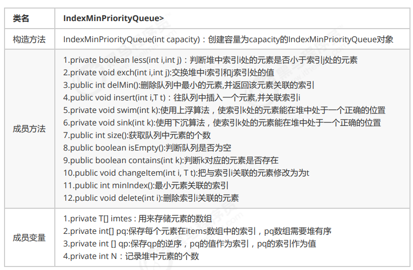
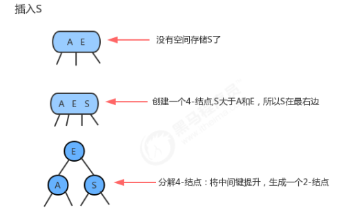

# 一、线性表

## 1.1、顺序表


顺序表是在计算机内存中以数组的形式保存的线性表，线性表的顺序存储是指用一组地址连续的存储单元，依次存 储线性表中的各个元素、使得线性表中再逻辑结构上响铃的数据元素存储在相邻的物理存储单元中，即通过数据元 素物理存储的相邻关系来反映数据元素之间逻辑上的相邻关系。

### 1.1.1、顺序表实现

**顺序表API设计：**


### 1.1.2、顺序表遍历

一般作为容器存储数据，都需要向外部提供遍历的方式，因此我们需要给顺序表提供遍历方式。

在java中，遍历集合的方式一般都是用的是forEach循环，如果想让我们的SequenceList也能支持forEach循环，则 需要做如下操作： 

1. 让SequenceList实现Iterable接口，重写iterator方法；
2. 在SequenceList内部提供一个内部类SIterator,实现Iterator接口，重写hasNext方法和next方法；

```java
public class SequenceList<T> implements Iterable<T> {

	//	线性表数据存储位置
	private T[] eles;
	//	元素个数
	private int N;

	//	构造函数
	public SequenceList(int capacity) {
//		初始化数组
		this.eles = (T[]) new Object[capacity];
//		初始化长度
		this.N = 0;
	}

	//	线性表置空
	public void clear() {
		this.N = 0;
	}

	//	判断当前线性表是否为空
	public boolean isEmpty() {
		return this.N == 0;
	}

	//	获取指定位置的元素
	public T get(int i) {
		if (i < 0 || i >= N) {
			throw new RuntimeException("当前元素不存在！");
		}
		return eles[i];
	}

	//	像线性表添加元素
	public void insert(T t) {
		if (N == eles.length) {
			throw new RuntimeException("当前表已满");
		}
		eles[N++] = t;
	}

	//	指定位置添加元素
	public void insert(int i, T t) {
		if (i == eles.length) {
			throw new RuntimeException("当前表已满");
		}
		if (i < 0 || i > N) {
			throw new RuntimeException("插入的位置不合法");
		}
//		i以后的元素后置
		for (int index = N; index > i; index--) {
			eles[index] = eles[index - 1];
		}
//		插入
		eles[i] = t;
		N++;
	}

	//	删除指定元素并返回
	public T remove(int i) {
		if (i < 0 || i > N - 1) {
			throw new RuntimeException("当前要删除的元素不存在");
		}
//		返回元素
		T current = eles[i];
//		元素前置
		for (int index = i; index < N - 1; index++) {
			eles[index] = eles[index + 1];
		}
//		长度减一
		N--;
		return current;
	}

	//	查询元素第一个索引
	public int indexOf(T t) {
		if (t == null) {
			throw new RuntimeException("查找的元素不合法");
		}
		for (int i = 0; i < N; i++) {
			if (eles[i].equals(t)) {
				return i;
			}
		}
		return -1;
	}

	@Override
	public String toString() {
		return "SequenceList{" +
				"eles=" + Arrays.toString(eles) +
				", N=" + N +
				'}';
	}

	@Override
	public Iterator<T> iterator() {
		return new SequenceListIterator();
	}

	private class SequenceListIterator implements Iterator {
		private int cusor;

		public SequenceListIterator() {
			this.cusor = 0;
		}

		@Override
		public boolean hasNext() {
			return cusor < N;
		}

		@Override
		public Object next() {
			return eles[cusor++];
		}
	}

}
```

### 1.1.3、顺序表容量可变

1. **添加元素时**

   添加元素时，应该检查当前数组的大小是否能容纳新的元素，如果不能容纳，则需要创建新的容量更大的数组，我 们这里创建一个是原数组两倍容量的新数组存储元素。

2. **移除元素时**

    移除元素时，应该检查当前数组的大小是否太大，比如正在用100个容量的数组存储10个元素，这样就会造成内存 空间的浪费，应该创建一个容量更小的数组存储元素。如果我们发现数据元素的数量不足数组容量的1/4，则创建 一个是原数组容量的1/2的新数组存储元素。

```java
//	数组扩容
	public void reSize(int newSize) {
//		定义临时数据指向原数组
		T[] temp = eles;
//		创建新数组
		eles = (T[]) new Object[newSize];
//		拷贝数据
		for (int i = 0; i < N; i++) {
			eles[i] = temp[i];
		}
	}
```

### 1.1.4、顺序便时间复杂度

- get(i):不难看出，不论数据元素量N有多大，只需要一次eles[i]就可以获取到对应的元素，所以时间复杂度为O(1);
-  insert(int i,T t):每一次插入，都需要把i位置后面的元素移动一次，随着元素数量N的增大，移动的元素也越多，时 间复杂为O(n); 
- remove(int i):每一次删除，都需要把i位置后面的元素移动一次，随着数据量N的增大,移动的元素也越多，时间复 杂度为O(n); 
- 由于顺序表的底层由数组实现，数组的长度是固定的，所以在操作的过程中涉及到了容器扩容操作。这样会导致顺 序表在使用过程中的时间复杂度不是线性的，在某些需要扩容的结点处，耗时会突增，尤其是元素越多，这个问题 越明显

### 1.1.5、5 java中ArrayList实现

java中ArrayList集合的底层也是一种顺序表，使用数组实现，同样提供了增删改查以及扩容等功能。

## 1.2、链表

### 1.2.1、单向链表


单向链表是链表的一种，它由多个结点组成，每个结点都由一个数据域和一个指针域组成，数据域用来存储数据， 指针域用来指向其后继结点。链表的头结点的数据域不存储数据，指针域指向第一个真正存储数据的结点。

- 单向链表API设计：


- 单向链表代码实现：

```java
public class LinkList<T> implements Iterable<T> {
	//	记录头节点
	private Node head;
	//	链表长度
	private int N;


	private class Node {
		//		存储数据
		T item;
		//		下一个节点
		Node next;

		public Node(T item, Node next) {
			this.item = item;
			this.next = next;
		}
	}

	public LinkList() {
//		初始化头节点
		this.head = new Node(null, null);
//		初始化元素个数
		this.N = 0;

	}

	//	清空
	public void clear() {
		head.next = null;
		this.N = 0;
	}

	//	获取链表长度
	public int length() {
		return N;
	}

	//	判断链表是否为空
	public boolean isEmpty() {
		return N == 0;
	}

	//	获取指定位置节点
	public T get(int i) {
		Node node = head.next;
		for (int index = 0; index < i; index++) {
			node = node.next;
		}
		return node.item;
	}

	//	插入数据
	public void insert(T t) {
		Node node = head;
//		遍历找到最后一个节点
		while (node.next != null) {
			node = node.next;
		}
//		创建新节点
		Node newNode = new Node(t, null);
//		尾节点指向新节点
		node.next = newNode;
//		长度加一
		N++;
	}

	//	指定位置插入新节点
	public void insert(int i, T t) {
//		找到i位置前一个节点
		Node pre = head;
		for (int index = 0; index < i; index++) {
			pre = pre.next;
		}
//      找到i位置节点
		Node curr = pre.next;

//      创建新节点，指向i节点
		Node newNode = new Node(t, curr);
//      i-1节点指向新节点
		pre.next = newNode;
//		长度加一
		N++;
	}

	//	删除指定位置节点
	public T remove(int i) {
//      找到i-1节点
		Node pre = head;
		for (int index = 0; index < i; index++) {
			pre = pre.next;
		}
//		找到i节点
		Node curr = pre.next;
//		找到i+1节点
		Node nextNode = curr.next;
//		i-1节点指向i+1节点
		pre.next = nextNode;
//		长度减一
		N--;
		return curr.item;
	}

	//	查找元素位置
	public int indexOf(T t) {
		Node node = head;
		for (int index = 0; node.next != null; index++) {
			node = node.next;
			if (node.item.equals(t)) {
				return index;
			}
		}
		return -1;
	}


	@Override
	public Iterator<T> iterator() {
		return new LinkListIterator();
	}

	public class LinkListIterator implements Iterator {

		private Node node;

		public LinkListIterator() {
			this.node = head;
		}

		@Override
		public boolean hasNext() {
			return node.next != null;
		}

		@Override
		public Object next() {
			node = node.next;
			return node.item;
		}
	}

	@Override
	public String toString() {
		return "LinkList{" +
				"head=" + head +
				", N=" + N +
				'}';
	}
}
```

### 1.2.2、双向链表

双向链表也叫双向表，是链表的一种，它由多个结点组成，每个结点都由一个数据域和两个指针域组成，数据域用 来存储数据，其中一个指针域用来指向其后继结点，另一个指针域用来指向前驱结点。链表的头结点的数据域不存 储数据，指向前驱结点的指针域值为null，指向后继结点的指针域指向第一个真正存储数据的结点。


结点API设计


双向链表API设计


双向链表代码

```java
public class TwoWayLinkList<T> implements Iterable<T> {

	//	首节点
	private Node head;
	//	尾节点
	private Node last;
	//	长度
	private int N;

	//	节点类
	private class Node {

		//		数据
		private T item;
		//		前一节点
		private Node pre;
		//		后一节点
		private Node next;

		//		构造函数

		public Node(T item, Node pre, Node next) {
			this.item = item;
			this.pre = pre;
			this.next = next;
		}
	}

	//	构造函数
	public TwoWayLinkList() {
		this.head = new Node(null, null, null);
		this.last = null;
		this.N = 0;
	}

	//	清空链表
	private void clear() {
		this.head.next = null;
		this.head.pre = null;
		this.last = null;
		this.N = 0;
	}

	//	获取链表长度
	public int length() {
		return N;
	}

	//	判空
	public boolean isEmpty() {
		return N == 0;
	}

	//	获取第一个元素
	public T getFirst() {
		if (isEmpty()) {
			return null;
		}
		return head.next.item;
	}

	//	获取最后一个元素
	public T getLast() {
		if (isEmpty()) {
			return null;
		}
		return last.item;
	}

	//	插入元素
	public void insert(T t) {
		if (isEmpty()) {
//			如果链表为空，创建新节点，让其成为尾节点，头节点只想尾节点
			Node newNode = new Node(t, head, null);
			last = newNode;
			head.next = last;
		} else {
//			不为空，创建新节点让其成为尾节点
			Node oldLast = last;
			Node newNode = new Node(t, oldLast, null);
			oldLast.next = newNode;
			last = newNode;
		}
		N++;
	}

	//	指定位置插入
	public void insert(int i, T t) {
//		找到i-1节点
		Node pre = head;
		for (int index = 0; index < i; index++) {
			pre = pre.next;
		}
//		找到i节点
		Node curr = pre.next;
//		创建新节点
		Node newNode = new Node(t, pre, curr);
//		i-1节点只相信节点
		pre.next = newNode;
//		i节点前一个节点指向新节点
		curr.pre = newNode;
		N++;
	}

	//	获取指定位置节点
	public T get(int i) {
		Node node = head.next;
		for (int index = 0; index < i; index++) {
			node = node.next;
		}
		return node.item;
	}

	//	查找元素位置
	public int indexOf(T t) {
		Node node = head;
		for (int index = 0; node.next != null; index++) {
			node = node.next;
			if (node.item.equals(t)) {
				return index;
			}
		}
		return -1;
	}

	//	删除指定元素
	public T remove(int i) {
//		i-1节点
		Node pre = head;
		for (int index = 0; index < i; index++) {
			pre = pre.next;
		}
//		i节点
		Node curr = pre.next;
//		i+1节点
		Node nextNode = curr.next;
		pre.next = nextNode;
		nextNode.pre = pre;
		N--;
		return curr.item;
	}

	@Override
	public Iterator<T> iterator() {
		return new TwoWayLinkListIterator();
	}

	private class TwoWayLinkListIterator implements Iterator {

		private Node node;

		public TwoWayLinkListIterator() {
			this.node = head;
		}

		@Override
		public boolean hasNext() {
			return node.next != null;
		}

		@Override
		public Object next() {
			node = node.next;
			return node.item;
		}
	}

	@Override
	public String toString() {
		return "TwoWayLinkList{" +
				"head=" + head +
				", last=" + last +
				", N=" + N +
				'}';
	}
}
```

### 1.2.3 、链表的时间复杂度分析

-  get(int i):每一次查询，都需要从链表的头部开始，依次向后查找，随着数据元素N的增多，比较的元素越多，时间 复杂度为O(n) 
- insert(int i,T t):每一次插入，需要先找到i位置的前一个元素，然后完成插入操作，随着数据元素N的增多，查找的 元素越多，时间复杂度为O(n); 
- remove(int i):每一次移除，需要先找到i位置的前一个元素，然后完成插入操作，随着数据元素N的增多，查找的元 素越多，时间复杂度为O(n) 相比较顺序表，链表插入和删除的时间复杂度虽然一样，但仍然有很大的优势，因为链表的物理地址是不连续的， 它不需要预先指定存储空间大小，或者在存储过程中涉及到扩容等操作,,同时它并没有涉及的元素的交换。 相比较顺序表，链表的查询操作性能会比较低。
- 因此，如果我们的程序中查询操作比较多，建议使用顺序表，增删 操作比较多，建议使用链表。

### 1.2.4、单链表反转


```java
//反转链表
	public void reverse() {
		if (isEmpty()) {
			return;
		}
		reverse(head.next);
	}

	/**
	 * 递归调用
	 *
	 * @param curr
	 * @return
	 */
	public Node reverse(Node curr) {
		if (curr.next == null) {
			head.next = curr;
			return curr;
		}
//		pre为curr节点的上一节点
		Node pre = reverse(curr.next);
		pre.next = curr;
		curr.next = null;
		return curr;
	}
```

### 1.2.5、快慢指针

#### 1.2.5.1、中间值


```java
	/**
	 * @return 链表的中间结点的值
	 * 使用两个指针遍历链表，当快指针遍历到结尾，慢指针正好指向中间
	 */
	public T getMid() {
		Node slow = this.head;
		Node fast = this.head;
		while (fast != null && fast.next != null) {
			fast = fast.next.next;
			slow = slow.next;
		}
		return slow.item;
	}
```

#### 1.2.5.2、单向链表是否有环


```java
	/**
	 * @return 是否有环
	 * 判断是否有环
	 */
	public boolean isCircle() {
//		定义快慢指针
		Node fast = this.head;
		Node slow = this.head;
		while (fast != null && fast.next != null) {
			fast = fast.next.next;
			slow = slow.next;
			if (fast.equals(slow)) {
				return true;
			}
		}
		return false;
	}
```

#### 1.2.5.3、有环链表入口

- 当快慢指针相遇时，我们可以判断到链表中有环，这时重新设定一个新指针指向链表的起点，且步长与慢指针一样 为1，则慢指针与“新”指针相遇的地方就是环的入口。
- 证明这一结论牵涉到数论的知识，这里略，只讲实现。


```java
	/**
	 * 环的入口
	 *
	 * @return 环的入口
	 */
	public Node getEntrance() {
//		定义指针
		Node fast = this.head;
		Node slow = this.head;
		Node temp = null;
//		判断是否有环
		while (fast != null && fast.next != null) {
			fast = fast.next.next;
			slow = slow.next;
			if (fast.equals(slow)) {
				temp = this.head;
				continue;
			}
			if (temp != null) {
				temp = temp.next;
				if (temp.equals(slow)) {
					return temp;
				}
			}
		}
		return null;
	}
```

### 1.2.6、约瑟夫问题

- **问题描述：** 

  传说有这样一个故事，在罗马人占领乔塔帕特后，39 个犹太人与约瑟夫及他的朋友躲到一个洞中，39个犹太人决 定宁愿死也不要被敌人抓到，于是决定了一个自杀方式，41个人排成一个圆圈，第一个人从1开始报数，依次往 后，如果有人报数到3，那么这个人就必须自杀，然后再由他的下一个人重新从1开始报数，直到所有人都自杀身亡 为止。然而约瑟夫和他的朋友并不想遵从。于是，约瑟夫要他的朋友先假装遵从，他将朋友与自己安排在第16个与 第31个位置，从而逃过了这场死亡游戏 。 

- **问题转换：** 

  41个人坐一圈，第一个人编号为1，第二个人编号为2，第n个人编号为n。 1.编号为1的人开始从1报数，依次向后，报数为3的那个人退出圈； 2.自退出那个人开始的下一个人再次从1开始报数，以此类推； 3.求出最后退出的那个人的编号。

-  **图示：**

  

- **代码实现：**

  ```java
  public class JosephTest {
  	public static void main(String[] args) {
  		//1.构建循环链表
  		Node<Integer> first = null;
  		//记录前一个结点
  		Node<Integer> pre = null;
  		for (int i = 1; i <= 41; i++) {
  			//第一个元素
  			if (i == 1) {
  				first = new Node(i, null);
  				pre = first;
  				continue;
  			}
  			Node<Integer> node = new Node<>(i, null);
  			pre.next = node;
  			pre = node;
  			if (i == 41) {
  				//构建循环链表，让最后一个结点指向第一个结点
  				pre.next = first;
  			}
  		}
  		//2.使用count，记录当前的报数值
  		int count = 0;
  		//3.遍历链表，每循环一次，count++
  		Node<Integer> n = first;
  		Node<Integer> before = null;
  		while (n != n.next) {
  			//4.判断count的值，如果是3，则从链表中删除这个结点并打印结点的值，把count重置为0；
  			count++;
  			if (count == 3) {
  				//删除当前结点
  				before.next = n.next;
  				System.out.print(n.item + ",");
  				count = 0;
  				n = n.next;
  			} else {
  				before = n;
  				n = n.next;
  			}
  		}
  		//		打印剩余的最后那个人
  		System.out.println(n.item);
  	}
  
  	public static class Node<T> {
  		T item;
  		Node<T> next;
  
  		public Node(T item, Node<T> next) {
  			this.item = item;
  			this.next = next;
  		}
  	}
  }
  ```

## 1.3、栈

- 栈是一种基于先进后出(FILO)的数据结构，是一种只能在一端进行插入和删除操作的特殊线性表。它按照先进后出 的原则存储数据，先进入的数据被压入栈底，最后的数据在栈顶，需要读数据的时候从栈顶开始弹出数据（最后一 个数据被第一个读出来）。

- 我们称数据进入到栈的动作为压栈，数据从栈中出去的动作为弹栈。

  

### 1.3.1、链栈实现

- 链栈API：

  

- 代码实现：

  ```java
  import java.util.Iterator;
  
  public class NodeStack<T> implements Iterable<T> {
  
  	//	首节点
  	private Node head;
  	//	栈中元素个数
  	private int N;
  
  	private class Node {
  		T item;
  		Node next;
  
  		public Node(T item, Node next) {
  			this.item = item;
  			this.next = next;
  		}
  	}
  
  	public NodeStack() {
  		this.head = new Node(null, null);
  		this.N = 0;
  	}
  
  	//	判空
  	public boolean isEmpty() {
  		return this.N == 0;
  	}
  
  	//	元素个数
  	public int size() {
  		return this.N;
  	}
  
  	//	压栈
  	public void push(T t) {
  		Node oleNode = head.next;
  		Node newNode = new Node(t, oleNode);
  		head.next = newNode;
  		this.N++;
  	}
  
  	//	出栈
  	public T pop() {
  		Node oleNode = head.next;
  		if (oleNode == null) {
  			return null;
  		}
  		head.next = oleNode.next;
  		N--;
  		return oleNode.item;
  	}
  
  	@Override
  	public Iterator<T> iterator() {
  		return new NodeStackIterator();
  	}
  
  	private class NodeStackIterator implements Iterator {
  
  		private Node node;
  
  		public NodeStackIterator() {
  			this.node = head;
  		}
  
  		@Override
  		public boolean hasNext() {
  			return node.next != null;
  		}
  
  		@Override
  		public Object next() {
  			node = node.next;
  			return node.item;
  		}
  	}
  }
  ```

### 1.3.2、括号匹配问题

- 问题描述：

  ```java
  给定一个字符串，里边可能包含"()"小括号和其他字符，请编写程序检查该字符串的中的小括号是否成对出现。
  例如：
  	"(上海)(长安)"：正确匹配
  	"上海((长安))"：正确匹配
  	"上海(长安(北京)(深圳)南京)":正确匹配
  	"上海(长安))"：错误匹配
  	"((上海)长安"：错误匹配
  ```

- 代码实现：

  ```java
  /**
   * 括号匹配问题
   */
  
  public class BracketMatchTest {
  	public static void main(String[] args) {
  		String str = "(上海(长安)())";
  		boolean match = isMatch(str);
  		System.out.println(str + "中的括号是否匹配：" + match);
  	}
  
  	/**
  	 * 判断str中的括号是否匹配
  	 *
  	 * @param str 括号组成的字符串
  	 * @return 如果匹配，返回true，如果不匹配，返回false
  	 */
  	public static boolean isMatch(String str) {
  //		创建栈
  		NodeStack<String> chars = new NodeStack<>();
  //		遍历字符串
  		for (int i = 0; i < str.length(); i++) {
  			String currChar = str.charAt(i) + "";
  //			判断当前字符是否为左括号，压入栈
  			if (currChar.equals("(")) {
  				chars.push(currChar);
  			} else if (currChar.equals(")")) {
  //				判断是否右括号，是则弹栈，判断弹出值是否为空
  				String pop = chars.pop();
  				if (pop == null) {
  					return false;
  				}
  			}
  		}
  		if (chars.size() == 0) {
  			return true;
  		} else {
  			return false;
  		}
  	}
  }
  ```

### 1.3.3、逆波兰表达式求值

- **中缀表达式：**

   中缀表达式就是我们平常生活中使用的表达式，例如：1+3*2,2-(1+3)等等，中缀表达式的特点是：二元运算符总 是置于两个操作数中间。

   中缀表达式是人们最喜欢的表达式方式，因为简单，易懂。但是对于计算机来说就不是这样了，因为中缀表达式的 运算顺序不具有规律性。不同的运算符具有不同的优先级，如果计算机执行中缀表达式，需要解析表达式语义，做 大量的优先级相关操作。

-  **逆波兰表达式(后缀表达式)：** 

  逆波兰表达式是波兰逻辑学家J・卢卡西维兹(J・ Lukasewicz)于1929年首先提出的一种表达式的表示方法，后缀表 达式的特点：运算符总是放在跟它相关的操作数之后。

  

- **需求：**

  给定一个只包含加减乘除四种运算的逆波兰表达式的数组表示方式，求出该逆波兰表达式的结果。

  ```java
  public class ReversePolishNotation {
  	public static void main(String[] args) {
  //中缀表达式3*（17-15）+18/6的逆波兰表达式如下
  		String[] notation = {"3", "17", "15", "-", "*","18", "6","/","+"};
  		int result = caculate(notation);
  		System.out.println("逆波兰表达式的结果为："+result);
  	}
  	/**
  	 * @param notaion 逆波兰表达式的数组表示方式
  	 * @return 逆波兰表达式的计算结果
  	 */
  	public static int caculate(String[] notaion){
  		return -1;
  	}
  }
  ```

- **分析：**

  ```java
  1.创建一个栈对象oprands存储操作数
  2.从左往右遍历逆波兰表达式，得到每一个字符串
  3.判断该字符串是不是运算符，如果不是，把该该操作数压入oprands栈中
  4.如果是运算符，则从oprands栈中弹出两个操作数o1,o2
  5.使用该运算符计算o1和o2，得到结果result
  6.把该结果压入oprands栈中
  7.遍历结束后，拿出栈中最终的结果返回
  ```

  

- 代码实现：

  ```java
  import com.example.linear.NodeStack;
  
  public class ReversePolishNotation {
  	public static void main(String[] args) {
  //中缀表达式3*（17-15）+18/6的逆波兰表达式如下
  		String[] notation = {"3", "17", "15", "-", "*", "18", "6", "/", "+"};
  		int result = caculate(notation);
  		System.out.println("逆波兰表达式的结果为：" + result);
  	}
  
  	/**
  	 * @param notaion 逆波兰表达式的数组表示方式
  	 * @return 逆波兰表达式的计算结果
  	 */
  	public static int caculate(String[] notaion) {
  //		创建栈
  		NodeStack<Integer> stack = new NodeStack<>();
  //		遍历表达式
  		for (int i = 0; i < notaion.length; i++) {
  			String curr = notaion[i];
  //			判断是什么运算符
  			Integer num1;
  			Integer num2;
  			Integer result;
  			switch (curr) {
  				case "+":
  //					如果是运算符+
  					num1 = stack.pop();
  					num2 = stack.pop();
  					result = num2 + num1;
  //					结果压栈
  					stack.push(result);
  					break;
  				case "-":
  //					如果是运算符-
  					num1 = stack.pop();
  					num2 = stack.pop();
  					result = num2 - num1;
  //					结果压栈
  					stack.push(result);
  					break;
  				case "*":
  //					如果是运算符*
  					num1 = stack.pop();
  					num2 = stack.pop();
  					result = num2 * num1;
  //					结果压栈
  					stack.push(result);
  					break;
  				case "/":
  //					如果是运算符/
  					num1 = stack.pop();
  					num2 = stack.pop();
  					result = num2 / num1;
  //					结果压栈
  					stack.push(result);
  					break;
  				default:
  					stack.push(Integer.parseInt(curr));
  					break;
  			}
  		}
  		return stack.pop();
  	}
  }
  ```

## 1.4、队列

队列是一种基于先进先出(FIFO)的数据结构，是一种只能在一端进行插入,在另一端进行删除操作的特殊线性表，它 按照先进先出的原则存储数据，先进入的数据，在读取数据时先读被读出来。


### 1.4.1、链式队列实现

- API：

  

- 代码实现：

  ```java
  import java.util.Iterator;
  
  public class LinkQueue<T> implements Iterable<T> {
  
  	//	队头节点
  	private Node head;
  	//	队尾节点
  	private Node tail;
  	//	元素个数
  	private int N;
  
  	class Node {
  		T item;
  		Node next;
  
  		public Node(T item, Node next) {
  			this.item = item;
  			this.next = next;
  		}
  	}
  
  	public LinkQueue() {
  		this.head = new Node(null, null);
  		this.tail = null;
  		this.N = 0;
  	}
  
  	//	判空
  	public boolean isEmpty() {
  		return N == 0;
  	}
  
  	//	队长
  	public int size() {
  		return N;
  	}
  
  	//	入队
  	public void enqueue(T t) {
  		if (tail == null) {
  			tail = new Node(t, null);
  			head.next = tail;
  		} else {
  			Node newNode = new Node(t, null);
  			tail.next = newNode;
  			tail = newNode;
  		}
  		N++;
  	}
  
  	//	出队
  	public T dequeue() {
  		if (isEmpty()) {
  			return null;
  		}
  		Node oldNode = head.next;
  		head.next = oldNode.next;
  		N--;
  //		如果节点删完，重置尾节点
  		if (isEmpty()) {
  			tail = null;
  		}
  		return oldNode.item;
  	}
  
  	@Override
  	public Iterator<T> iterator() {
  		return new LinkQueueIterator();
  	}
  
  	private class LinkQueueIterator implements Iterator {
  		private Node node;
  
  		public LinkQueueIterator() {
  			this.node = head;
  		}
  
  		@Override
  		public boolean hasNext() {
  			return node.next != null;
  		}
  
  		@Override
  		public Object next() {
  			node = node.next;
  			return node.item;
  		}
  	}
  }
  ```

### 1.4.2、优先队列

- 普通的队列是一种先进先出的数据结构，元素在队列尾追加，而从队列头删除。在某些情况下，我们可能需要找出 队列中的最大值或者最小值，例如使用一个队列保存计算机的任务，一般情况下计算机的任务都是有优先级的，我 们需要在这些计算机的任务中找出优先级最高的任务先执行，执行完毕后就需要把这个任务从队列中移除。普通的 队列要完成这样的功能，需要每次遍历队列中的所有元素，比较并找出最大值，效率不是很高，这个时候，我们就 可以使用一种特殊的队列来完成这种需求，优先队列。
- 

#### 1.4.2.1、最大优先队列

- **而堆这种结构是可以方便的删除最大的值，基于堆区实现最大优先队列**

- **API**：

  

- **代码**：

  ```java
  /**
   * 最大优先队列
   */
  
  public class MaxPriorityQueue<T extends Comparable<T>> {
  
  	private T[] item;
  	private int N;
  
  	public MaxPriorityQueue(int capacity) {
  		this.item = (T[]) new Comparable[capacity + 1];
  		this.N = 0;
  	}
  
  	//	判断堆中索引i处的元素是否小于索引j处的元素
  	private boolean less(int i, int j) {
  		return item[i].compareTo(item[j]) < 0;
  	}
  
  	//	交换堆中i索引和j索引处的值
  	private void exch(int i, int j) {
  		T temp = item[i];
  		item[i] = item[j];
  		item[j] = temp;
  	}
  
  	//	删除队列中最大的元素,并返回这个最大元素
  	public T delMax() {
  		T max = item[1];
  		exch(1, N);
  		N--;
  		sink(1);
  		return max;
  	}
  
  	//	往队列中插入一个元素
  	public void insert(T t) {
  		item[++N] = t;
  		swim(N);
  	}
  
  	//	使用上浮算法，使索引k处的元素能在堆中处于一个正确的位置
  	private void swim(int k) {
  		while (k > 1) {
  			if (less(k / 2, k)) {
  				exch(k / 2, k);
  			}
  			k = k / 2;
  		}
  	}
  
  	//	使用下沉算法，使索引k处的元素能在堆中处于一个正确的位置
  	private void sink(int k) {
  		while (k * 2 <= N) {
  			int max = k * 2;
  			if (2 * k + 1 <= N && less(2 * k, 2 * k + 1)) {
  				max = 2 * k + 1;
  			}
  			if (less(k, max)) {
  				exch(k, max);
  			}
  			k = max;
  		}
  	}
  
  	//	获取队列中元素的个数
  	public int size() {
  		return this.N;
  	}
  
  	//	判断队列是否为空
  	public boolean isEmpty() {
  		return this.N == 0;
  	}
  }
  ```

  

#### 1.4.2.2、最小优先队列

- **最小堆的思想**：
  1. 最小的元素放在数组的索引1处。
  2. 每个结点的数据总是小于等于它的两个子结点的数据。

- **代码**：

  ```java
  /**
   * 最小优先队列
   */
  
  public class MinPriorityQueue<T extends Comparable<T>> {
  	private T[] item;
  	private int N;
  
  	public MinPriorityQueue(int capacity) {
  		this.item = (T[]) new Comparable[capacity + 1];
  		this.N = 0;
  	}
  
  	//	判断堆中索引i处的元素是否小于索引j处的元素
  	private boolean less(int i, int j) {
  		return item[i].compareTo(item[j]) < 0;
  	}
  
  	//	交换堆中i索引和j索引处的值
  	private void exch(int i, int j) {
  		T temp = item[i];
  		item[i] = item[j];
  		item[j] = temp;
  	}
  
  	//	删除队列中最小的元素,并返回这个最小元素
  	public T delMin() {
  		T max = item[1];
  		exch(1, N);
  		N--;
  		sink(1);
  		return max;
  	}
  
  	//	往队列中插入一个元素
  	public void insert(T t) {
  		item[++N] = t;
  		swim(N);
  	}
  
  	//	使用上浮算法，使索引k处的元素能在堆中处于一个正确的位置
  	private void swim(int k) {
  		while (k > 1) {
  			if (less(k, k / 2)) {
  				exch(k, k / 2);
  			}
  			k = k / 2;
  		}
  	}
  
  	//	使用下沉算法，使索引k处的元素能在堆中处于一个正确的位置
  	private void sink(int k) {
  		while (k * 2 <= N) {
  			int min = k * 2;
  			if (2 * k + 1 <= N && less(2 * k + 1, 2 * k)) {
  				min = 2 * k + 1;
  			}
  			if (less(min, k)) {
  				exch(min, k);
  			}
  			k = min;
  		}
  	}
  
  	//	获取队列中元素的个数
  	public int size() {
  		return this.N;
  	}
  
  	//	判断队列是否为空
  	public boolean isEmpty() {
  		return this.N == 0;
  	}
  }
  ```

#### 1.4.2.3、索引优先队列

- 通过索引访问已存在于优先队列中的对象，并更新它们
- 

- **要点**：
  1. 所有数组舍弃0索引
  2. item只存储数据，不改变顺序·
  3. pq数组存储堆调整后的顺序
  4. qp数组存储pq的反

- API

  

- **代码**：

  ```java
  /**
   * 最小索引优先队列
   */
  
  public class IndexMinPriorityQueue<T extends Comparable<T>> {
  
  	//	用来存储元素的数组
  	private T[] item;
  	//	保存每个元素在items数组中的索引，pq数组需要堆有序
  	private int[] pq;
  	//	保存qp的逆序，pq的值作为索引，pq的索引作为值
  	private int[] qp;
  	//	记录堆中元素的个数
  	private int N;
  
  	public IndexMinPriorityQueue(int capacity) {
  		this.N = 0;
  		this.item = (T[]) new Comparable[capacity + 1];
  		this.pq = new int[capacity + 1];
  		this.qp = new int[capacity + 1];
  
  //		默认队列未存数据，qp值置为-1
  		for (int i = 0; i < qp.length; i++) {
  			qp[i] = -1;
  		}
  	}
  
  	//	获取队列中元素的个数
  	public int size() {
  		return N;
  	}
  
  	//判断队列是否为空
  	public boolean isEmpty() {
  		return N == 0;
  	}
  
  	//	判断堆中索引i处的元素是否小于索引j处的元素
  	private boolean less(int i, int j) {
  		return item[pq[i]].compareTo(item[pq[j]]) < 0;
  	}
  
  	//	交换堆中i索引和j索引处的值
  	private void exch(int i, int j) {
  //		交换pq
  		int temp = pq[i];
  		pq[i] = pq[j];
  		pq[j] = temp;
  //		交换qp
  		qp[pq[i]] = i;
  		qp[pq[j]] = j;
  	}
  
  	//	判断k对应的元素是否存在
  	public boolean contains(int k) {
  		return qp[k] != -1;
  	}
  
  	//最小元素关联的索引
  	public int minIndex() {
  		return pq[1];
  	}
  
  	public T get(int index) {
  		return item[pq[qp[index]]];
  	}
  
  	//	往队列中插入一个元素,并关联索引i
  	public void insert(int i, T t) {
  //		判断i是否被关联
  		if (contains(i)) {
  			return;
  		}
  //		N++
  		N++;
  		item[i] = t;
  //		pq
  		pq[N] = i;
  //		qp
  		qp[i] = N;
  //		上浮
  		swim(N);
  	}
  
  	//	使用上浮算法，使索引k处的元素能在堆中处于一个正确的位置
  	private void swim(int k) {
  		while (k > 1) {
  			if (less(k, k / 2)) {
  				exch(k, k / 2);
  			}
  			k = k / 2;
  		}
  	}
  
  	//	删除队列中最小的元素,并返回该元素关联的索引
  	public T delMin() {
  		int minIndex = pq[1];
  		T t = item[minIndex];
  //		交换元素
  		exch(1, N);
  //		删除最后节点
  		item[pq[N]] = null;
  		qp[pq[N]] = -1;
  		pq[N] = -1;
  //		下沉算法
  		N--;
  		sink(1);
  		return t;
  	}
  
  	//	使用下沉算法，使索引k处的元素能在堆中处于一个正确的位置
  	private void sink(int k) {
  		while (2 * k <= N) {
  			int min = k * 2;
  			if (2 * k + 1 <= N && less(2 * k + 1, 2 * k)) {
  				min = 2 * k + 1;
  			}
  			if (less(min, k)) {
  				exch(min, k);
  			}
  			k = min;
  		}
  	}
  
  	//	删除索引i关联的元素
  	public void delete(int i) {
  		//		找到k在pq中的索引
  		int index = qp[i];
  //		交换pq中index与N的值
  		exch(index, N);
  //		删除item
  		item[pq[N]] = null;
  		qp[pq[N]] = -1;
  		pq[N] = -1;
  		N--;
  //		调整堆
  		sink(index);
  		swim(index);
  	}
  
  	//	把与索引i关联的元素修改为为t
  	public void changeItem(int i, T t) {
  		item[i] = t;
  		int index = qp[i];
  		swim(index);
  		sink(index);
  	}
  }
  ```

  

# 二、符号表

符号表最主要的目的就是将一个键和一个值联系起来，符号表能够将存储的数据元素是一个键和一个值共同组成的 键值对数据，我们可以根据键来查找对应的值。


- 符号表中，键具有唯一性。

- 符号表在实际生活中的使用场景是非常广泛的，见下表：

  

## 2.1、符号表

- 节点类：

  

- 符号表：

  

- 符号表代码实现

  ```java
  public class SymbolTable<Key, Value> {
  
  	//	头节点
  	private Node head;
  	//	元素个数
  	private int N;
  
  	private class Node {
  		private Key key;
  		private Value value;
  		private Node next;
  
  		public Node(Key key, Value value, Node next) {
  //			键
  			this.key = key;
  //			值
  			this.value = value;
  			this.next = next;
  		}
  	}
  
  	public SymbolTable() {
  		this.N = 0;
  		this.head = new Node(null, null, null);
  	}
  
  	//	元素个数
  	public int size() {
  		return N;
  	}
  
  	//	插入
  	public void put(Key key, Value value) {
  //		表中已存在键，找到该节点，替换值
  		Node node = head;
  		while (node.next != null) {
  			node = node.next;
  			if (node.key.equals(key)) {
  				node.value = value;
  				return;
  			}
  		}
  //		不存在，创建新节点
  		Node newNode = new Node(key, value, null);
  		newNode.next = head.next;
  		head.next = newNode;
  		N++;
  	}
  
  	//	删除
  	public void delete(Key key) {
  		Node node = head;
  		while (node.next != null) {
  			if (node.next.key.equals(key)) {
  				node.next = node.next.next;
  				N--;
  				return;
  			}
  			node = node.next;
  		}
  	}
  
  	//	获取
  	public Value get(Key key) {
  		Node node = head;
  		while (node.next != null) {
  			node = node.next;
  			if (node.key.equals(key)) {
  				return node.value;
  			}
  		}
  		return null;
  	}
  
  }
  ```

## 2.2、有序符号表

```java
public class OrderSymbolTable<Key extends Comparable<Key>, Value> {

	//	头节点
	private Node head;
	//	元素个数
	private int N;

	private class Node {
		private Key key;
		private Value value;
		private Node next;

		public Node(Key key, Value value, Node next) {
//			键
			this.key = key;
//			值
			this.value = value;
			this.next = next;
		}
	}

	public OrderSymbolTable() {
		this.N = 0;
		this.head = new Node(null, null, null);
	}

	//	元素个数
	public int size() {
		return N;
	}

	//	插入
	public void put(Key key, Value value) {
//		当前节点
		Node curr = head.next;
//		当前节点前一节点
		Node pre = head;
//		compareTo比较
		while (curr != null && key.compareTo(curr.key) > 0) {
			curr = curr.next;
			pre = pre.next;
		}
//		节点已存在
		if (curr != null && key.compareTo(curr.key) == 0) {
			curr.value = value;
			return;
		}
//		节点不存在
		Node newNode = new Node(key, value, curr);
		pre.next = newNode;
	}

	//	删除
	public void delete(Key key) {
		Node node = head;
		while (node.next != null) {
			if (node.next.key.equals(key)) {
				node.next = node.next.next;
				N--;
				return;
			}
			node = node.next;
		}
	}

	//	获取
	public Value get(Key key) {
		Node node = head;
		while (node.next != null) {
			node = node.next;
			if (node.key.equals(key)) {
				return node.value;
			}
		}
		return null;
	}

}
```

# 三、树

## 3.1、树基础知识

**树具有以下特点：** 

- 每个结点有零个或多个子结点；
- .没有父结点的结点为根结点；
- 每一个非根结点只有一个父结点；
- 每个结点及其后代结点整体上可以看做是一棵树，称为当前结点的父结点的一个子树；

**树的相关术语**：

- 节点的度：一个结点含有的子树的个数称为该结点的度
- 叶节点：度为0的结点称为叶结点，也可以叫做终端结点
- 分支节点：度不为0的结点称为分支结点，也可以叫做非终端结点
- 节点的层次：从根结点开始，根结点的层次为1，根的直接后继层次为2，以此类推
- 节点的层序编号：将树中的结点，按照从上层到下层，同层从左到右的次序排成一个线性序列，把他们编成连续的自然数
- 树的度：树中所有结点的度的最大值
- 树的高度（深度）：树中结点的最大层次
- 森林：m（m>=0）个互不相交的树的集合，将一颗非空树的根结点删去，树就变成一个森林；给森林增加一个统一的根 结点，森林就变成一棵树
- 子节点：一个结点的直接后继结点称为该结点的孩子结点
- 父节点：一个结点的直接前驱称为该结点的双亲结点
- 兄弟节点：同一双亲结点的孩子结点间互称兄弟结点

二叉树基本定义：二叉树就是度不超过2的树(每个结点最多有两个子结点)

- **满二叉树：**一个二叉树，如果每一个层的结点树都达到最大值，则这个二叉树就是满二叉树

  

- **完全二叉树：**叶节点只能出现在最下层和次下层，并且最下面一层的结点都集中在该层最左边的若干位置的二叉树

  

## 3.2、链式二叉查找树

- 结点类API：

  

- 二叉查找树API：

  

- 代码实现：

  ```java
  public class BinaryTree<Key extends Comparable<Key>, Value> {
  
  	//	根节点
  	private Node root;
  
  	//	元素个数
  	private int N;
  
  	private class Node {
  		private Key key;
  		private Value value;
  		//		左子树
  		private Node left;
  		//		右子树
  		private Node right;
  
  		public Node(Key key, Value value, Node left, Node right) {
  			this.key = key;
  			this.value = value;
  			this.left = left;
  			this.right = right;
  		}
  	}
  
  	//	元素个数
  	public int size() {
  
  		return N;
  	}
  
  	//	添加元素
  	public void put(Key key, Value value) {
  		root = put(root, key, value);
  	}
  
  	//	向指定的树x中添加key-value,并返回添加元素后新的树
  	public Node put(Node node, Key key, Value value) {
  		if (node == null) {
  			N++;
  			return new Node(key, value, null, null);
  		}
  		int compare = key.compareTo(node.key);
  		if (compare > 0) {
  //			递归找右子树
  			node.right = put(node.right, key, value);
  		} else if (compare < 0) {
  //			递归找左子树
  			node.left = put(node.left, key, value);
  		} else {
  			node.value = value;
  		}
  		return node;
  	}
  
  	//	获取
  	public Value get(Key key) {
  		return get(root, key);
  	}
  
  	//	获取指定节点值
  	public Value get(Node node, Key key) {
  		if (node == null) {
  			return null;
  		}
  		int compare = key.compareTo(node.key);
  		if (compare > 0) {
  			return get(node.right, key);
  		} else if (compare < 0) {
  			return get(node.left, key);
  		} else {
  			return node.value;
  		}
  	}
  
  	//	删除
  	public void delete(Key key) {
  		delete(root, key);
  	}
  
  	//	删除指定节点
  	public Node delete(Node node, Key key) {
  		if (node == null) {
  			return null;
  		}
  		int compare = key.compareTo(node.key);
  		if (compare > 0) {
  			node.right = delete(node.right, key);
  		} else if (compare < 0) {
  			node.left = delete(node.left, key);
  		} else {
  			N--;
  			if (node.left == null) {
  				return node.right;
  			}
  			if (node.right == null) {
  				return node.left;
  			}
  //			找到最小节点
  			Node minNode = node.right;
  			while (minNode.left != null) {
  				minNode = minNode.left;
  			}
  //			删除最小节点
  			Node n = node.right;
  			while (n.left != null) {
  				if (n.left.left == null) {
  					n.left = null;
  				} else {
  					n = n.left;
  				}
  			}
  			minNode.left = node.left;
  			minNode.right = node.right;
  			node = minNode;
  		}
  		return node;
  	}
  }
  ```

## 3.3、二叉查找树便捷方法

### 3.3.1、查找二叉树最小键


```java
//	全局查找最小键
	public Key minKey() {
		return minKey(root).key;
	}

	//	查找最小键
	public Node minKey(Node node) {
		if (node.left != null) {
			return minKey(node.left);
		} else {
			return node;
		}
	}
```

### 3.3.2、查找二叉树最大键


```java
//	全局查找最大键
	public Key maxKey() {
		return maxKey(root).key;
	}

	//	查找最大键
	public Node maxKey(Node node) {
		if (node.right != null) {
			return maxKey(node.right);
		} else {
			return node;
		}
	}
```

## 3.4、二叉树遍历

- 前序遍历； 

  先访问根结点，然后再访问左子树，最后访问右子树 

- 中序遍历； 

  先访问左子树，中间访问根节点，最后访问右子树 

- 后序遍历； 

  先访问左子树，再访问右子树，最后访问根节点

### 3.4.1、前序遍历

- public Queue preErgodic()：使用前序遍历，获取整个树中的所有键 
- private void preErgodic(Node x,Queue keys)：使用前序遍历，把指定树x中的所有键放入到keys队列中

```java
//	前序遍历
	public LinkQueue<Key> preErgodic() {
		LinkQueue<Key> keys = new LinkQueue<>();
		preErgodic(root, keys);
		return keys;
	}

	public void preErgodic(Node node, LinkQueue<Key> keys) {
		if (node == null) {
			return;
		}

//		节点键入队
		keys.enqueue(node.key);

//		递归遍历左子树
		if (node.left != null) {
			preErgodic(node.left, keys);
		}

//		递归遍历右子树
		if (node.right != null) {
			preErgodic(node.right, keys);
		}
	}
```

### 3.4.2、中序遍历

- public Queue midErgodic()：使用中序遍历，获取整个树中的所有键 
- private void midErgodic(Node x,Queue keys)：使用中序遍历，把指定树x中的所有键放入到keys队列中

```java
//	中序遍历
	public LinkQueue<Key> midErgodic() {
		LinkQueue<Key> keys = new LinkQueue<>();
		midErgodic(root, keys);
		return keys;
	}

	public void midErgodic(Node node, LinkQueue<Key> keys) {
		if (node == null) {
			return;
		}

		if (node.left != null) {
			midErgodic(node.left, keys);
		}

		keys.enqueue(node.key);

		if (node.right != null) {
			midErgodic(node.right, keys);
		}
	}
```

### 3.4.3、后序遍历

- public Queue afterErgodic()：使用后序遍历，获取整个树中的所有键 
- private void afterErgodic(Node x,Queue keys)：使用后序遍历，把指定树x中的所有键放入到keys队列中

```java
//	后序遍历
	public LinkQueue<Key> afterErgodic() {
		LinkQueue<Key> keys = new LinkQueue<>();
		afterErgodic(root, keys);
		return keys;
	}

	public void afterErgodic(Node node, LinkQueue<Key> keys) {
		if (node == null) {
			return;
		}

		if (node.left != null) {
			afterErgodic(node.left, keys);
		}

		if (node.right != null) {
			afterErgodic(node.right, keys);
		}

		keys.enqueue(node.key);
	}
```

## 3.5、层序遍历

- 图片：

  

- 实现步骤
  1. 创建队列，存储每一层的结点；
  2. 使用循环从队列中弹出一个结点：
  3. 获取当前结点的key； 
  4. 如果当前结点的左子结点不为空，则把左子结点放入到队列中
  5. 如果当前结点的右子结点不为空，则把右子结点放入到队列中

- 代码：

  ```
  //	层序遍历
  	public LinkQueue<Key> layerErgodic() {
  		LinkQueue<Node> nodes = new LinkQueue<>();
  		LinkQueue<Key> keys = new LinkQueue<>();
  		nodes.enqueue(root);
  		while (!nodes.isEmpty()) {
  			Node dequeue = nodes.dequeue();
  			keys.enqueue(dequeue.key);
  			if (dequeue.left != null) {
  				nodes.enqueue(dequeue.left);
  			}
  			if (dequeue.right != null) {
  				nodes.enqueue(dequeue.right);
  			}
  		}
  		return keys;
  	}
  ```

## 3.6、二叉树最大深度

- 实现： 

  - 我们在1.4中创建的树上，添加如下的API求最大深度： 

  - public int maxDepth()：计算整个树的最大深度 private int maxDepth(Node x):计算指定树x的最大深度

- 实现步骤： 

  - 如果根结点为空，则最大深度为0；

  - 计算左子树的最大深度；

  - 计算右子树的最大深度； 

  - 当前树的最大深度=左子树的最大深度和右子树的最大深度中的较大者+1

- 代码：

  ```java
  //	最大深度
  	public int maxDepth() {
  		return maxDepth(root);
  	}
  
  	public int maxDepth(Node node) {
  		if (node == null) {
  			return 0;
  		}
  		int max = 0;
  //		左子树最大深度
  		int maxL = 0;
  //		右子树最大深度
  		int maxR = 0;
  //		计算左子树最大深度
  		if (node.left != null) {
  			maxL = maxDepth(node.left);
  		}
  //		计算右子树最大深度
  		if (node.right != null) {
  			maxR = maxDepth(node.right);
  		}
  		max = Math.max(maxL, maxR) + 1;
  		return max;
  	}
  ```

## 3.7、折纸问题

- 需求： 

  请把一段纸条竖着放在桌子上，然后从纸条的下边向上方对折1次，压出折痕后展开。此时 折痕是凹下去的，即折 痕突起的方向指向纸条的背面。如果从纸条的下边向上方连续对折2 次，压出折痕后展开，此时有三条折痕，从上 到下依次是下折痕、下折痕和上折痕。

   给定一 个输入参数N，代表纸条都从下边向上方连续对折N次，请从上到下打印所有折痕的方向 例如：N=1时，打 印： down；N=2时，打印： down down up

  

- 分析： 

  我们把对折后的纸张翻过来，让粉色朝下，这时把第一次对折产生的折痕看做是根结点，那第二次对折产生的下折 痕就是该结点的左子结点，而第二次对折产生的上折痕就是该结点的右子结点，这样我们就可以使用树型数据结构 来描述对折后产生的折痕。 

  这棵树有这样的特点： 

  1. 根结点为下折痕； 
  2. 每一个结点的左子结点为下折痕；
  3. 每一个结点的右子结点为上折痕；

  ​	 	

- 代码：

  ```java
  import com.example.linear.LinkQueue;
  
  /**
   * 折纸问题
   */
  public class PagerFoldingTest {
  	public static void main(String[] args) {
  		Node tree = createTree(3);
  		printTree(tree);
  	}
  
  	public static Node createTree(int N) {
  		Node root = null;
  		for (int i = 0; i < N; i++) {
  			if (i == 0) {
  				root = new Node("down", null, null);
  				continue;
  			} else {
  				LinkQueue<Node> nodes = new LinkQueue<>();
  				nodes.enqueue(root);
  				while (!nodes.isEmpty()) {
  					Node dequeue = nodes.dequeue();
  					if (dequeue.left != null) {
  						nodes.enqueue(dequeue.left);
  					}
  					if (dequeue.right != null) {
  						nodes.enqueue(dequeue.right);
  					}
  					if (dequeue.left == null && dequeue.right == null) {
  						dequeue.left = new Node("down", null, null);
  						dequeue.right = new Node("up", null, null);
  					}
  				}
  			}
  		}
  		return root;
  	}
  
  	//3.使用中序遍历，打印出树中所有结点的内容；
  	private static void printTree(Node tree) {
  		if (tree == null) {
  			return;
  		}
  		printTree(tree.left);
  		System.out.print(tree.item + ",");
  		printTree(tree.right);
  	}
  
  	//1.定义结点类
  	private static class Node {
  		//存储结点元素
  		String item;
  		//左子结点
  		Node left;
  		//右子结点
  		Node right;
  
  		public Node(String item, Node left, Node right) {
  			this.item = item;
  			this.left = left;
  			this.right = right;
  		}
  	}
  }
  ```

## 3.8、树进阶

### 3.8.1、平衡树

- 保证树最差插入情况下的查找效率

#### 3.8.1.1、2-3查找树

##### 3.8.1.1.1、定义

- 为了保证查找树的平衡性，我们需要一些灵活性，因此在这里我们允许树中的一个结点保存多个键。确切的说，我 们将一棵标准的二叉查找树中的结点称为2-结点(含有一个键和两条链)，而现在我们引入3-结点，它含有两个键和 三条链。2-结点和3-结点中的每条链都对应着其中保存的键所分割产生的一个区间。

- 2-结点：

   含有一个键(及其对应的值)和两条链，左链接指向2-3树中的键都小于该结点，右链接指向的2-3树中的键都大 于该结点。

-  3-结点：

  含有两个键(及其对应的值)和三条链，左链接指向的2-3树中的键都小于该结点，中链接指向的2-3树中的键都 位于该结点的两个键之间，右链接指向的2-3树中的键都大于该结点。

- 

##### 3.8.1.1.2、查找

- 将二叉查找树的查找算法一般化我们就能够直接得到2-3树的查找算法。要判断一个键是否在树中，我们先将它和 根结点中的键比较。如果它和其中任意一个相等，查找命中；否则我们就根据比较的结果找到指向相应区间的连 接，并在其指向的子树中递归地继续查找。如果这个是空链接，查找未命中
- 

##### 3.8.1.1.3、插入

1. 向2-节点插入新节点
   - 往2-3树中插入元素和往二叉查找树中插入元素一样，首先要进行查找，然后将节点挂到未找到的节点上。2-3树之 所以能够保证在最差的情况下的效率的原因在于其插入之后仍然能够保持平衡状态。如果查找后未找到的节点是一 个2-结点，那么很容易，我们只需要将新的元素放到这个2-结点里面使其变成一个3-结点即可。但是如果查找的节 点结束于一个3-结点，那么可能有点麻烦。
   - 
2. 向一棵只含有一个3-结点的树中插入新节点
   - 假设2-3树只包含一个3-结点，这个结点有两个键，没有空间来插入第三个键了，最自然的方式是我们假设这个结 点能存放三个元素，暂时使其变成一个4-结点，同时他包含四条链接。然后，我们将这个4-结点的中间元素提升， 左边的键作为其左子结点，右边的键作为其右子结点。插入完成，变为平衡2-3查找树，树的高度从0变为1
   - 
3. 向一个父结点为2-结点的3-结点中插入新节点
   - 和上面的情况一样一样，我们也可以将新的元素插入到3-结点中，使其成为一个临时的4-结点，然后，将该结点中 的中间元素提升到父结点即2-结点中，使其父结点成为一个3-结点，然后将左右结点分别挂在这个3-结点的恰当位置
   - 
4. 向一个父结点为3-结点的3-结点中插入新节点
   - 当我们插入的结点是3-结点的时候，我们将该结点拆分，中间元素提升至父结点，但是此时父结点是一个3-结点， 插入之后，父结点变成了4-结点，然后继续将中间元素提升至其父结点，直至遇到一个父结点是2-结点，然后将其 变为3-结点，不需要继续进行拆分
   - 
5. 分解根结点
   - 当插入结点到根结点的路径上全部是3-结点的时候，最终我们的根结点会编程一个临时的4-结点，此时，就需要将 根结点拆分为两个2-结点，树的高度加1。
   - 

##### 3.8.1.1.4、2-3树性质

- 任意空链接到根结点的路径长度都是相等的。 
- 4-结点变换为3-结点时，树的高度不会发生变化，只有当根结点是临时的4-结点，分解根结点时，树高+1。 
- 2-3树与普通二叉查找树最大的区别在于，普通的二叉查找树是自顶向下生长，而2-3树是自底向上生长。

### 3.8.2、红黑树

红黑树主要是对2-3树进行编码，红黑树背后的基本思想是用标准的二叉查找树(完全由2-结点构成)和一些额外的信 息(替换3-结点)来表示2-3树。我们将树中的链接分为两种类型： 

- 红链接：将两个2-结点连接起来构成一个3-结点； 
- 黑链接：则是2-3树中的普通链接。 

确切的说，我们将3-结点表示为只由一条左斜的红色链接(两个2-结点其中之一是另一个的左子结点)相连的两个2- 结点。这种表示法的一个优点是，我们无需修改就可以直接使用标准的二叉查找树的get方法。


#### 3.8.2.1、红黑树定义

红黑树是含有红黑链接并满足以下条件的二叉查找树：

- 红链接均为左链接
- 没有任何节点和两条红链接相连
- 该树黑链接平衡，任何空节点到根节点的黑链接数相同


#### 3.8.2.2、节点API设计

- 因为每个结点都只会有一条指向自己的链接（从它的父结点指向它），我们可以在之前的Node结点中添加一个布 尔类型的变量color来表示链接的颜色。如果指向它的链接是红色的，那么该变量的值为true，如果链接是黑色 的，那么该变量的值为false。

  

- API

  

#### 3.8.2.3、红黑树平衡化

##### 3.8.2.3.1、左旋

- 当某个结点的左子结点为黑色，右子结点为红色，此时需要左旋。 
- 前提：当前结点为h，它的右子结点为x；
-  左旋过程： 
  1. 让x的左子结点变为h的右子结点：h.right=x.left; 
  2. 让h成为x的左子结点：x.left=h; 
  3. 让h的color属性变为x的color属性值：x.color=h.color; 
  4. 让h的color属性变为RED ：h.color=true;


##### 3.8.2.3.2、右旋

- 当某个结点的左子结点是红色，且左子结点的左子结点也是红色，需要右旋 
- 前提：当前结点为h，它的左子结点为x； 
- 右旋过程：
  1. 让x的右子结点成为h的左子结点：h.left = x.right; 
  2. 让h成为x的右子结点：x.right=h; 
  3. 让x的color变为h的color属性值：x.color = h.color; 
  4. 让h的color为RED；


#### 3.8.2.4、红黑树插入

##### 1、向单个2-结点中插入新键

- 一棵只含有一个键的红黑树只含有一个2-结点。插入另一个键后，我们马上就需要将他们旋转。 

- 如果新键小于当前结点的键，我们只需要新增一个红色结点即可，新的红黑树和单个3-结点完全等价。

  

- 如果新键大于当前结点的键，那么新增的红色结点将会产生一条红色的右链接，此时我们需要通过左旋，把 红色右链接变成左链接，插入操作才算完成。形成的新的红黑树依然和3-结点等价，其中含有两个键，一条红 色链接。

  

##### 2、向底部的2-结点插入新键

用和二叉查找树相同的方式向一棵红黑树中插入一个新键，会在树的底部新增一个结点（可以保证有序性），唯一 区别的地方是我们会用红链接将新结点和它的父结点相连。如果它的父结点是一个2-结点，那么刚才讨论的两种方 式仍然适用。


##### 3、颜色反转

当一个结点的左子结点和右子结点的color都为RED时，也就是出现了临时的4-结点，此时只需要把左子结点和右子 结点的颜色变为BLACK，同时让当前结点的颜色变为RED即可。


##### 4、根结点的颜色总是黑色

之前我们介绍结点API的时候，在结点Node对象中color属性表示的是父结点指向当前结点的连接的颜色，由于根 结点不存在父结点，所以每次插入操作后，我们都需要把根结点的颜色设置为黑色。

#### 3.8.2.5、红黑树API


#### 3.8.2.6、代码实现

```java
public class RedBlackTree<Key extends Comparable<Key>, Value> {

	//	标记根节点
	private Node root;

	//	元素个数
	private int N;

	//	红色链接标识
	private static final boolean RED = true;

	//	黑色链接标识
	private static final boolean BLACK = false;


	private class Node {
		private Key key;
		private Value value;
		private Node left;
		private Node right;
		//		其父节点指向它的连接颜色
		private boolean color;

		public Node(Key key, Value value, Node left, Node right, boolean color) {
			this.key = key;
			this.value = value;
			this.left = left;
			this.right = right;
			this.color = color;
		}
	}

	public RedBlackTree() {
		this.N = 0;
//		this.root = new Node(null, null, null, null, BLACK);
	}

	//	判断当前结点的父指向链接是否为红色
	private boolean isRed(Node x) {
		if (x == null) {
			return BLACK;
		}
		return x.color == RED;
	}

	//	左旋调整
	private Node rotateLeft(Node h) {
//		x节点为h节点右子节点
		Node x = h.right;
//		h右子节点为x左子节点
		h.right = x.left;
//		x左子节点为h
		x.left = h;
//		x的颜色为h的颜色
		x.color = h.color;
//		h的颜色为红色
		h.color = RED;
		return x;
	}

	//	右旋调整
	private Node rotateRight(Node h) {
		Node x = h.left;
		h.left = x.right;
		x.right = h;
		x.color = h.color;
		h.color = RED;
		return x;
	}

	//	颜色反转,相当于完成拆分4-结点
	private void flipColors(Node h) {
//		当前节点变红
		h.color = RED;
//		左右子节点变黑
		h.left.color = BLACK;
		h.right.color = BLACK;
	}

	//	在整个树上完成插入操作
	public void put(Key key, Value val) {
		root = put(root, key, val);
//		根节点颜色总是黑色
		root.color = BLACK;
	}

	//	在指定树中，完成插入操作,并返回添加元素后新的树
	private Node put(Node h, Key key, Value val) {
//		如果节点为空，返回一个红节点
		if (h == null) {
			N++;
			return new Node(key, val, null, null, RED);
		}
//		比较
		int compare = key.compareTo(h.key);

		if (compare < 0) {
			h.left = put(h.left, key, val);
		} else if (compare > 0) {
			h.right = put(h.right, key, val);
		} else {
			h.value = val;
		}
//		左旋
		if (!isRed(h.left) && isRed(h.right)) {
			h = rotateLeft(h);
		}
//		右旋
		if (isRed(h.left) && isRed(h.left.left)) {
			h = rotateRight(h);
		}
//		颜色反转
		if (isRed(h.left) && isRed(h.right)) {
			flipColors(h);
		}
		return h;
	}

	//	根据key，从树中找出对应的值
	public Value get(Key key) {
		return get(root, key);
	}

	//	从指定的树x中，找出key对应的值
	private Value get(Node x, Key key) {
		if (x == null) {
			return null;
		}
		int compare = key.compareTo(x.key);
		if (compare < 0) {
			return get(x.left, key);
		} else if (compare > 0) {
			return get(x.right, key);
		} else {
			return x.value;
		}
	}

	//	获取树中元素的个数
	public int size() {
		return this.N;
	}
}
```

### 3.8.3、B-树

B树允许一个节点有多于两个键存在

#### 3.8.3.1、B树特性

B树中允许一个结点中包含多个key，可以是3个、4个、5个甚至更多，并不确定，需要看具体的实现。现在我们选 择一个参数M，来构造一个B树，我们可以把它称作是M阶的B树，那么该树会具有如下特点： 

- 每个结点最多有M-1个key，并且以升序排列；
-  每个结点最多能有M个子结点； 
- 根结点至少有两个子结点；

在实际应用中B树的阶数一般都比较大（通常大于100），所以，即使存储大量的数据，B树的高度仍然比较小，这 样在某些应用场景下，就可以体现出它的优势。


#### 3.8.3.2、B树存储数据

若参数M选择为5，那么每个结点最多包含4个键值对，我们以5阶B树为例，看看B树的数据存储。


#### 3.8.3.3、B树在磁盘文件中的应用

磁盘能够保存大量的数据，从GB一直到TB级，但是 他的读取速度比较慢，因为涉及到机器操作，读取速度为毫秒级 。


磁盘由盘片构成,每个盘片有两面，又称为盘面 。盘片中央有一个可以旋转的主轴，他使得盘片以固定的旋转速率 旋转，通常是5400rpm或者是7200rpm,一个磁盘中包含了多个这样的盘片并封装在一个密封的容器内 。盘片的每 个表面是由一组称为磁道同心圆组成的 ，每个磁道被划分为了一组扇区 ，每个扇区包含相等数量的数据位，通常 是512个子节，扇区之间由一些间隙隔开,这些间隙中不存储数据 。


磁盘用磁头来读写存储在盘片表面的位，而磁头连接到一个移动臂上，移动臂沿着盘片半径前后移动，可以将磁头 定位到任何磁道上，这称之为寻道操作。一旦定位到磁道后，盘片转动，磁道上的每个位经过磁头时，读写磁头就 可以感知到该位的值，也可以修改值。对磁盘的访问时间分为 **寻道时间**，**旋转时间**，以及**传送时间**。 

由于存储介质的特性，磁盘本身存取就比主存慢很多，再加上机械运动耗费，因此为了提高效率，要尽量减少磁盘 I/O，减少读写操作。 为了达到这个目的，磁盘往往不是严格按需读取，而是每次都会预读，即使只需要一个字 节，磁盘也会从这个位置开始，顺序向后读取一定长度的数据放入内存。这样做的理论依据是计算机科学中著名的 局部性原理：当一个数据被用到时，其附近的数据也通常会马上被使用。由于磁盘顺序读取的效率很高（不需要寻 道时间，只需很少的旋转时间），因此预读可以提高I/O效率。

页是计算机管理存储器的逻辑块，硬件及操作系统往往将主存和磁盘存储区分割为连续的大小相等的块，每个存储 块称为一页（1024个字节或其整数倍），预读的长度一般为页的整倍数。主存和磁盘以页为单位交换数据。当程 序要读取的数据不在主存中时，会触发一个缺页异常，此时系统会向磁盘发出读盘信号，磁盘会找到数据的起始位 置并向后连续读取一页或几页载入内存中，然后异常返回，程序继续运行。 

文件系统的设计者利用了磁盘预读原理，将一个结点的大小设为等于一个页（1024个字节或其整数倍），这样每 个结点只需要一次I/O就可以完全载入。那么3层的B树可以容纳1024*1024*1024差不多10亿个数据，如果换成二 叉查找树，则需要30层！假定操作系统一次读取一个节点，并且根节点保留在内存中，那么B树在10亿个数据中查 找目标值，只需要小于3次硬盘读取就可以找到目标值，但红黑树需要小于30次，因此B树大大提高了IO的操作效 率。

### 3.8.4、B+树

B+树是对B树的一种变形树，它与B树的差异在于：

- 非叶结点仅具有索引作用，也就是说，非叶子结点只存储key，不存储value； 
- 树的所有叶结点构成一个有序链表，可以按照key排序的次序遍历全部数据。

#### 3.8.4.1、B+树存储数据

若参数M选择为5，那么每个结点最多包含4个键值对，我们以5阶B+树为例，看看B+树的数据存储。


#### 3.8.4.2、B+树和B树的对比

- **B+ 树的优点在于**：

  1. 由于B+树在非叶子结点上不包含真正的数据，只当做索引使用，因此在内存相同的情况下，能够存放更多的 key。 
  2. B+树的叶子结点都是相连的，因此对整棵树的遍历只需要一次线性遍历叶子结点即可。而且由于数据顺序 排列并且相连，所以便于**区间查找和搜索**。而B树则需要进行每一层的递归遍历。 

- **B树的优点在于**： 

  由于B树的每一个节点都包含key和value，因此我们根据key查找value时，只需要找到key所在的位置，就能找到 value，但B+树只有叶子结点存储数据，索引每一次查找，都必须一次一次，一直找到树的最大深度处，也就是叶子结点的深度，才能找到value。

#### 3.8.4.3、 B+树在数据库中的应用

- 在数据库的操作中，查询操作可以说是最频繁的一种操作，因此在设计数据库时，必须要考虑到查询的效率问题， 在很多数据库中，都是用到了B+树来提高查询的效率； 
- 在操作数据库时，我们为了提高查询效率，可以基于某张表的某个字段建立索引，就可以提高查询效率，那其实这 个索引就是B+树这种数据结构实现的。


## 3.9、并查集

并查集是一种树型的数据结构 ，并查集可以高效地进行如下操作： 

- 查询元素p和元素q是否属于同一组 

- 合并元素p和元素q所在的组

  

### 3.9.1、并查集结构

并查集也是一种树型结构，但这棵树跟我们之前讲的二叉树、红黑树、B树等都不一样，这种树的要求比较简单： 

1.  每个元素都唯一的对应一个结点；

2.  每一组数据中的多个元素都在同一颗树中；

3.  一个组中的数据对应的树和另外一个组中的数据对应的树之间没有任何联系；

4.  元素在树中并没有子父级关系的硬性要求；

   

### 3.9.2、并查集API设计


### 3.9.3、并查集实现

#### 3.9.3.1、UF构造方法实现

1. 初始情况下，每个元素都在一个独立的分组中，所以，初始情况下，并查集中的数据默认分为N个组； 
2. 初始化数组eleAndGroup；
3.  把eleAndGroup数组的索引看做是每个结点存储的元素，把eleAndGroup数组每个索引处的值看做是该结点 所在的分组，那么初始化情况下，i索引处存储的值就是i
4. 

- **索引代表节点存储元素，值代表元素所在表的标识**

#### 3.9.3.2、union(int p,int q)合并方法实现

1. 如果p和q已经在同一个分组中，则无需合并 
2. 如果p和q不在同一个分组，则需要将p元素所在组的**所有的元素的组标识符**修改为q元素所在组的标识符即 可
3. 分组数量-1
4. 

#### 3.9.3.3、并查集代码

```java
/**
 * 并查集
 */

public class UF {

	//	记录结点元素和该元素的父结点
	private int[] eleAndGroup;

	//	记录并查集中数据的分组个数
	private int count;

	public UF(int N) {
//		初始化分组数量，默认N组
		this.count = N;

//		初始化eleAndGroup数组
		this.eleAndGroup = new int[N];

//		初始化eleAndGroup中元素及其所在分组标识,把eleAndGroup数组每个索引处的值看做是该结点所在的分组，那么初始化情况下，i索引处存储的值就是i
		for (int i = 0; i < eleAndGroup.length; i++) {
			eleAndGroup[i] = i;
		}
	}


	//	获取当前并查集中的数据有多少个分组
	public int count() {
		return this.count;
	}

	//	判断并查集中元素p和元素q是否在同一分组中
	public boolean connected(int p, int q) {
		return find(p) == find(q);
	}

	//	元素p所在分组的标识符
	public int find(int p) {
		return eleAndGroup[p];
	}

	//	把p元素所在分组和q元素所在分组合并
	public void union(int p, int q) {
		if (connected(p, q)) {
			return;
		}
//		如果p和q不在同一个分组，则只需要将p元素所在组的所有的元素的组标识符修改为q元素所在组的标识符即可
		int pGroup = find(p);
		int qGroup = find(q);
		for (int i = 0; i < eleAndGroup.length; i++) {
			if (eleAndGroup[i] == pGroup) {
				eleAndGroup[i] = qGroup;
			}
		}
//		分组数量-1
		count--;
	}
}
```

### 3.9.4、UF_Tree算法优化

为了提升union算法的性能，我们需要重新设计find方法和union方法的实现，此时我们先需要对我们的之前数据结 构中的eleAndGourp数组的含义进行重新设定： 

1. 我们仍然让eleAndGroup数组的索引作为某个结点的元素；

2. eleAndGroup[i]的值不再是当前结点所在的分组标识，而是该**结点的父结点**；

   

#### 3.9.4.1、UF_Tree API设计


#### 3.9.4.2、find(int p)查询方法实现

1. 判断当前元素p的父结点eleAndGroup[p]是不是自己，如果是自己则证明已经是根结点了； 

2. 如果当前元素p的父结点不是自己，则让p=eleAndGroup[p]，继续找父结点的父结点,直到找到根结点为止；

   

#### 3.9.4.3、union(int p,int q)合并方法实现

1. 找到p元素所在树的根结点 

2. 找到q元素所在树的根结点 

3. 如果p和q已经在同一个树中，则无需合并； 

4. 如果p和q不在同一个分组，则只需要将p元素所在树根结点的父结点设置为q元素的根结点即可；

5. 分组数量-1

   

#### 3.9.4.4、代码实现

```java
/**
 * UF_Tree
 */
public class UF_Tree {

	//	记录结点元素和该元素的父结点
	private int[] eleAndGroup;
	//  记录并查集中数据的分组个数
	private int count;

	public UF_Tree(int N) {
		//		初始化分组数量，默认N组
		this.count = N;

//		初始化eleAndGroup数组
		this.eleAndGroup = new int[N];

//		初始化eleAndGroup中元素及其所在分组标识,把eleAndGroup数组每个索引处的值看做是该结点所在的分组，那么初始化情况下，i索引处存储的值就是i
		for (int i = 0; i < eleAndGroup.length; i++) {
			eleAndGroup[i] = i;
		}

	}

	//	获取当前并查集中的数据有多少个分组
	public int count() {
		return this.count;
	}

	//	判断并查集中元素p和元素q是否在同一分组中
	public boolean connected(int p, int q) {
		return find(p) == find(q);
	}

	//	元素p所在分组的标识符,及根节点
	public int find(int p) {
		while (true) {
			if (p == eleAndGroup[p]) {
				return p;
			}
			p = eleAndGroup[p];
		}
	}

	//	把p元素所在分组和q元素所在分组合并
	public void union(int p, int q) {
//找到p、q的根节点
		int pRoot = find(p);
		int qRoot = find(q);
//		根节点相等
		if (pRoot == qRoot) {
			return;
		}
//		将p元素所在树根结点的父结点设置为q元素的根结点
		eleAndGroup[pRoot] = qRoot;
		this.count--;
	}
}
```

### 3.9.5、路径压缩

UF_Tree中最坏情况下union算法的时间复杂度为O(N^2)，其最主要的问题在于最坏情况下，树的深度和数组的大小一样，如果我们能够通过一些算法让合并时，生成的树的深度尽可能的小，就可以优化find方法。 之前我们在union算法中，合并树的时候将任意的一棵树连接到了另外一棵树，这种合并方法是比较暴力的，如果 我们把并查集中每一棵树的大小记录下来，然后在每次合并树的时候，把较小的树连接到较大的树上，就可以减小 树的深度。


只要我们保证每次合并，都能把小树合并到大树上，就能够压缩合并后新树的路径，这样就能提高find方法的效 率。为了完成这个需求，我们需要另外一个数组来记录存储每个根结点对应的树中元素的个数，并且需要一些代码 调整数组中的值。

#### 3.9.5.1、UF_Tree_Weighted API设计


#### 3.9.5.2、代码实现

```java
/**
 * UF_Tree_Weighted
 */
public class UF_Tree_Weighted {

	//	记录结点元素和该元素的父结点
	private int[] eleAndGroup;
	//  记录并查集中数据的分组个数
	private int count;

	//	存储每个根结点对应的树中元素的个数
	private int[] sz;

	public UF_Tree_Weighted(int N) {
		//		初始化分组数量，默认N组
		this.count = N;

//		初始化eleAndGroup数组
		this.eleAndGroup = new int[N];
		sz = new int[N];


//		初始化eleAndGroup中元素及其所在分组标识,把eleAndGroup数组每个索引处的值看做是该结点所在的分组，那么初始化情况下，i索引处存储的值就是i
		for (int i = 0; i < eleAndGroup.length; i++) {
			eleAndGroup[i] = i;
		}

		//把sz数组中所有的元素初始化为1，默认情况下，每个结点都是一个独立的树，每个树中只有一个元素
		for (int i = 0; i < sz.length; i++) {
			sz[i] = 1;
		}


	}

	//	获取当前并查集中的数据有多少个分组
	public int count() {
		return this.count;
	}

	//	判断并查集中元素p和元素q是否在同一分组中
	public boolean connected(int p, int q) {
		return find(p) == find(q);
	}

	//	元素p所在分组的标识符,及根节点
	public int find(int p) {
		while (true) {
			if (p == eleAndGroup[p]) {
				return p;
			}
			p = eleAndGroup[p];
		}
	}

	//	把p元素所在分组和q元素所在分组合并
	public void union(int p, int q) {
//找到p、q的根节点
		int pRoot = find(p);
		int qRoot = find(q);
//		根节点相等
		if (pRoot == qRoot) {
			return;
		}
//		判断大小,小的合并到大的
		if (sz[pRoot] < sz[qRoot]) {
			eleAndGroup[pRoot] = qRoot;
			sz[qRoot] += sz[pRoot];
		} else {
			eleAndGroup[qRoot] = pRoot;
			sz[pRoot] += sz[qRoot];
		}
//		将p元素所在树根结点的父结点设置为q元素的根结点

		this.count--;
	}
}
```

### 3.9.6、畅通工程

某省调查城镇交通状况，得到现有城镇道路统计表，表中列出了每条道路直接连通的城镇。省政府“畅通工程”的目 标是使全省任何两个城镇间都可以实现交通（但不一定有直接的道路相连，只要互相间接通过道路可达即可）。问 最少还需要建设多少条道路？ 

在我们的测试数据文件夹中有一个trfficproject.txt文件，它就是诚征道路统计表，下面是对数据的解释：


总共有20个城市，目前已经修改好了7条道路，问还需要修建多少条道路，才能让这20个城市之间全部相通？ 

**解题思路：** 

1. 创建一个并查集UF_Tree_Weighted(20); 
2. 分别调用union(0,1),union(6,9),union(3,8),union(5,11),union(2,12),union(6,10),union(4,8)，表示已经修建好的 道路把对应的城市连接起来； 
3. 如果城市全部连接起来，那么并查集中剩余的分组数目为1，所有的城市都在一个树中，所以，只需要获取当前 并查集中剩余的数目，减去1，就是还需要修建的道路数目； 

**代码：**

```java
import java.io.BufferedReader;
import java.io.InputStreamReader;

public class Traffic_ProjectTest {

	public static void main(String[] args) throws Exception {
//		构建缓冲读取流
		BufferedReader bufferedReader = new BufferedReader(new InputStreamReader(
				Traffic_ProjectTest.class
						.getClassLoader()
						.getResourceAsStream("trffic_project.txt")));
//		读取第一行20
		int totalNum = Integer.parseInt(bufferedReader.readLine());
//		创建并查集对象
		UF_Tree_Weighted UF = new UF_Tree_Weighted(totalNum);
//		第二行7
		int roadNum = Integer.parseInt(bufferedReader.readLine());
//		循环读取
		for (int i = 0; i < roadNum; i++) {
			String line = bufferedReader.readLine();//0 1
			String[] strings = line.split(" ");
			int p = Integer.parseInt(strings[0]);
			int q = Integer.parseInt(strings[1]);
			//		调用union方法
			UF.union(p, q);
		}

//		当前并查集分组数量减一得到结果
		System.out.println(UF.count() - 1);
	}
}
```


# 四、堆

## 4.1、堆定义

堆是计算机科学中一类特殊的数据结构的统称，堆通常可以被看做是一棵完全二叉树的数组对象。

- **完全二叉树**：

  除了树的最后一层结点不需要是满的，其它的每一层从左到右都是满的

  

- **数组实现**：

  是将二叉树的结点按照层级顺序放入数组中，根结点在位置1，它的子结点在位置2和3，废弃0节点


## 4.2、堆的API设计


## 4.3、堆实现

### 4.3.1、insert实现

1. 新节点插入到最后
2. 执行上浮算法
   - 新节点与父节点比较大小
   - 大于父节点，与父节点换值，指针指向父节点，循环执行上浮算法
   - 小于父节点，插入完成

```java
//	插入
	public void insert(T t) {
//		++N取巧，先执行自增运算
		items[++N] = t;
		swim(N);
	}

	//	上浮算法
	private void swim(int k) {
//		根节点不许遍历
		while (k > 1) {
//			比较当前节点与父节点
			if (less(k / 2, k)) {
//				交换
				exch(k / 2, k);
			}
			k = k / 2;
		}
	}
```

### 4.3.2、delete实现

1. 删除最大节点及第一个节点
2. 用最后节点顶替首节点位置
3. 执行下沉算法
   - 首节点与左右子节点比较大小
   - 首节点最大则删除完成
   - 否则首节点与左右子节点较大者换值，指针指向较大者，循环下沉算法

```java
//	删除最大元素
	public T delMax() {
//		记录最大值
		T max = items[1];
//交换最大值与最后节点
		exch(1, N);
		items[N] = null;
		N--;
//		最大节点下沉
		sink(1);
		return max;
	}

	//	下沉算法
	private void sink(int k) {
//		终止条件
		while (2 * k <= N) {
			int max;
			if (2 * k + 1 <= N) {
				if (less(2 * k, 2 * k + 1)) {
					max = 2 * k + 1;
				} else {
					max = 2 * k;
				}
			} else {
				max = 2 * k;
			}
			if (!less(k, max)) {
				break;
			}
			exch(k, max);
			k = max;
		}
	}
```

### 4.3.3、堆代码

```java
public class ArrayHeap<T extends Comparable> {

	//	元素
	private T[] items;
	//	元素个数
	public int N;

	public ArrayHeap(int capacity) {
//		废弃0索引
		this.items = (T[]) new Comparable[capacity + 1];
		this.N = 0;
	}

	//	判断堆中索引i元素是否小于索引j元素
	private boolean less(int i, int j) {
		return items[i].compareTo(items[j]) < 0;
	}

	//	交换值
	public void exch(int i, int j) {
		T temp = items[i];
		items[i] = items[j];
		items[j] = temp;
	}

	//	插入
	public void insert(T t) {
//		++N取巧，先执行自增运算
		items[++N] = t;
		swim(N);
	}

	//	上浮算法
	private void swim(int k) {
//		根节点不许遍历
		while (k > 1) {
//			比较当前节点与父节点
			if (less(k / 2, k)) {
//				交换
				exch(k / 2, k);
			}
			k = k / 2;
		}
	}

	//	删除最大元素
	public T delMax() {
//		记录最大值
		T max = items[1];
//交换最大值与最后节点
		exch(1, N);
		items[N] = null;
		N--;
//		最大节点下沉
		sink(1);
		return max;
	}

	//	下沉算法
	private void sink(int k) {
//		终止条件
		while (2 * k <= N) {
			int max;
			if (2 * k + 1 <= N) {
				if (less(2 * k, 2 * k + 1)) {
					max = 2 * k + 1;
				} else {
					max = 2 * k;
				}
			} else {
				max = 2 * k;
			}
			if (!less(k, max)) {
				break;
			}
			exch(k, max);
			k = max;
		}
	}
}
```

## 4.4、堆排序

- **实现步骤：**

  1. 构造堆；
  2. 得到堆顶元素，这个值就是最大值； 
  3. 交换堆顶元素和数组中的最后一个元素，此时所有元素中的最大元素已经放到合适的位置
  4. 对堆进行调整，重新让除了最后一个元素的剩余元素中的最大值放到堆顶； 
  5. 重复2~4这个步骤，直到堆中剩一个元素为止。

- **API**：

  

- **堆建造过程**
  1. System.arraycopy方法将目标数组复制到heap
  2. 从heap的length/2处遍历到1（后一半为叶子节点，不需下沉）
  3. 遍历执行下沉算法

- **堆排序过程**
  1. 交换第一节点与最后节点
  2. 定义索引num为堆长
  3. num--并下沉第一节点
  4. heap复制到source

- **代码：**

  ```java
  public class HeapSort {
  
  	public static void sort(Comparable[] source) {
  		Comparable[] heap = new Comparable[source.length + 1];
  		createHeap(source, heap);
  //		定义索引
  		int num = heap.length - 1;
  		while (num != 1) {
  			exch(heap, 1, num);
  			num--;
  			sink(heap, 1, num);
  		}
  		System.arraycopy(heap, 1, source, 0, source.length);
  	}
  
  	public static void createHeap(Comparable[] source, Comparable[] heap) {
  //		复制
  		System.arraycopy(source, 0, heap, 1, source.length);
  		for (int i = (heap.length - 1) / 2; i > 0; i--) {
  			sink(heap, i, heap.length - 1);
  		}
  	}
  
  	public static void sink(Comparable[] heap, int target, int range) {
  		while (2 * target <= range) {
  			int max = 2 * target;
  			if (2 * target + 1 <= range && less(heap, 2 * target, 2 * target + 1)) {
  				max = 2 * target + 1;
  			}
  			if (!less(heap, target, max)) {
  				break;
  			}
  			exch(heap, target, max);
  			target = max;
  		}
  	}
  
  	//	比较
  	public static boolean less(Comparable[] heap, int i, int j) {
  		return heap[i].compareTo(heap[j]) < 0;
  	}
  
  	//	换值
  	public static void exch(Comparable[] heap, int i, int j) {
  		Comparable temp = heap[i];
  		heap[i] = heap[j];
  		heap[j] = temp;
  	}
  }
  ```

# 五、图

## 5.1、无向图

### 5.1.1、相关术语

- 相邻顶点： 当两个顶点通过一条边相连时，我们称这两个顶点是相邻的，并且称这条边依附于这两个顶点。 
- 度： 某个顶点的度就是依附于该顶点的边的个数 
- 子图： 是一幅图的所有边的子集(包含这些边依附的顶点)组成的图； 
- 路径： 是由边顺序连接的一系列的顶点组成 
- 环： 是一条至少含有一条边且终点和起点相同的路径
- 连通图： 如果图中任意一个顶点都存在一条路径到达另外一个顶点，那么这幅图就称之为连通图
- 连通子图： 一个非连通图由若干连通的部分组成，每一个连通的部分都可以称为该图的连通子图

### 5.1.2、图的存储-邻接矩阵

- 使用一个V*V的二维数组int[V] [V],把索引的值看做是顶点； 

- 如果顶点v和顶点w相连，我们只需要将adj[[V] [W]]和adj[[W] [V]]的值设置为1,否则设置为0即可。

- 邻接矩阵这种存储方式的空间复杂度是V^2的，如果我们处理的问题规模比较大的话，内存空间极有可能不够用.

  

### 5.1.3、图的存储-邻接表

- 使用一个大小为V的数组 Queue[V] adj，把索引看做是顶点； 

- 每个索引处adj[v]存储了一个队列，该队列中存储的是所有与该顶点相邻的其他顶点

  

### 5.1.4、无向图实现

#### 5.1.4.1、API


#### 5.1.4.2、代码

```java
/**
 * 无向图
 */
public class Graph {

	//	记录顶点数量
	private final int V;
	//	记录边数量
	private int E;
	//	邻接表
	private LinkQueue<Integer>[] adj;

	Graph(int V) {
		this.V = V;
		this.E = 0;
		this.adj = new LinkQueue[V];

		for (int i = 0; i < adj.length; i++) {
			adj[i] = new LinkQueue<Integer>();
		}

	}

	//	获取图中顶点的数量
	public int V() {
		return this.V;
	}

	//	获取图中边的数量
	public int E() {
		return this.E;
	}

	//  向图中添加一条边 v-w
	public void addEdge(int v, int w) {
//把w添加到v的链表中，这样顶点v就多了一个相邻点w
		adj[v].enqueue(w);
//把v添加到w的链表中，这样顶点w就多了一个相邻点v
		adj[w].enqueue(v);
//		边数量加1
		E++;
	}

	//	获取和顶点v相邻的所有顶点
	public LinkQueue adj(int v) {
		return adj[v];
	}
}
```

### 5.1.5、图的搜索

#### 5.1.5.1、深度优先遍历

所谓的深度优先搜索，指的是在搜索时，如果遇到一个结点既有子结点，又有兄弟结点，那么先找子结点，然后找 兄弟结点。


API：


代码：

```java
/**
 * 深度优先搜索
 */
public class DepthFirstSearch {

	//	索引代表顶点，值表示当前顶点是否已经被搜索
	private boolean[] marked;
	//	记录有多少个顶点与s顶点相通
	private int count;

	//	构造深度优先搜索对象，使用深度优先搜索找出G图中s顶点的所有相通顶点
	public DepthFirstSearch(Graph G, int s) {
//		创建和点数相同的boole数组
		marked = new boolean[G.V()];
//		搜索图中与s点相通的所有点
		dfs(G, s);
	}

	//	使用深度优先搜索找出G图中v顶点的所有相通顶点
	private void dfs(Graph G, int v) {
//		标记该点已搜索
		marked[v] = true;
		for (Object o : G.adj(v)) {
			if (!marked[(Integer) o]) {
				dfs(G, (Integer) o);
			}
		}
		this.count++;
	}

	//	判断w顶点与s顶点是否相通
	public boolean marked(int w) {
		return marked[w];
	}

	//	获取与顶点s相通的所有顶点的总数
	public int count() {
		return this.count;
	}
}
```

#### 5.1.5.2、广度优先遍历

所谓的深度优先搜索，指的是在搜索时，如果遇到一个结点既有子结点，又有兄弟结点，那么先找兄弟结点，然后 找子结点。


API:


代码：

```java
/**
 * 广度优先搜索
 */
public class BreadthFirstSearch {

	//	索引代表顶点，值表示当前顶点是否已经被搜索
	private boolean[] marked;
	//	记录有多少个顶点与s顶点相通
	private int count;
	//	用来存储待搜索邻接表的点
	private LinkQueue<Integer> waitSearch;

	//	构造广度优先搜索对象，使用广度优先搜索找出G图中s顶点的所有相邻顶点
	public BreadthFirstSearch(Graph G, int s) {
//		创建boole数组
		marked = new boolean[G.V()];
		this.count = 0;
		this.waitSearch = new LinkQueue<Integer>();
//		搜索与s点相通的点
		bfs(G, s);
	}

	//	使用广度优先搜索找出G图中v顶点的所有相邻顶点
	private void bfs(Graph G, int v) {
		marked[v] = true;
		waitSearch.enqueue(v);
		while (!waitSearch.isEmpty()) {
			Integer wait = waitSearch.dequeue();
			for (Object o : G.adj(wait)) {
				if (!marked((Integer) o)) {
					bfs(G, (Integer) o);
				}
			}
		}
		count++;
	}

	//	判断w顶点与s顶点是否相通
	public boolean marked(int w) {
		return marked[w];
	}

	//	获取与顶点s相通的所有顶点的总数
	public int count() {
		return this.count;
	}
}
```

### 5.1.6、应用-畅通工程


总共有20个城市，目前已经修改好了7条道路，问9号城市和10号城市是否相通？9号城市和8号城市是否相通？ 

**解题思路**： 

1. 创建一个图Graph对象，表示城市； 
2. 分别调用 addEdge(0,1),addEdge(6,9),addEdge(3,8),addEdge(5,11),addEdge(2,12),addEdge(6,10),addEdge(4,8)，表示已 经修建好的道路把对应的城市连接起来； 
3. 通过Graph对象和顶点9，构建DepthFirstSearch对象或BreadthFirstSearch对象； 
4. 调用搜索对象的marked(10)方法和marked(8)方法，即可得到9和城市与10号城市以及9号城市与8号城市是否相 通。

**代码**：

```java
/**
 * 畅通工程图实现
 */
public class Traffic_Project2 {
	public static void main(String[] args) throws Exception {
		//创建输入流
		BufferedReader reader = new BufferedReader(new InputStreamReader(
				Traffic_Project2.class.getClassLoader()
				.getResourceAsStream("trffic_project.txt")));

		//读取城市数目，初始化Graph图
		int number = Integer.parseInt(reader.readLine());
		Graph G = new Graph(number);
//读取已经修建好的道路数目
		int roadNumber = Integer.parseInt(reader.readLine());
//循环读取已经修建好的道路，并调用addEdge方法
		for (int i = 0; i < roadNumber; i++) {
			String line = reader.readLine();
			int p = Integer.parseInt(line.split(" ")[0]);
			int q = Integer.parseInt(line.split(" ")[1]);
			G.addEdge(p, q);
		}

		//根据图G和顶点9构建图的搜索对象
//BreadthFirstSearch search = new BreadthFirstSearch(G,9);
		DepthFirstSearch search = new DepthFirstSearch(G, 9);
//调用搜索对象的marked(10)方法和marked(8)方法
		boolean flag1 = search.marked(10);
		boolean flag2 = search.marked(8);
		System.out.println("9号城市和10号城市是否已相通：" + flag1);
		System.out.println("9号城市和8号城市是否已相通：" + flag2);

	}
}
```

### 5.1.7、路径查找


- 实现路径查找，最基本的操作还是得遍历并搜索图，所以，我们的实现暂且基于深度优先搜索来完成。
- 其搜索的过程是比较简单的。我们添加了edgeTo[]整型数组，这个整型数组会记录从每个顶点回到起点s的路径。 
- 如果我们把顶点设定为0，那么它的搜索可以表示为下图：


**代码**：

```java
/**
 * 路径搜素
 */
public class DepthFirstPaths {

	//	索引代表顶点，值表示当前顶点是否已经被搜索
	private boolean[] marked;
	//	起点
	private int s;
	//	索引代表顶点，值代表从起点s到当前顶点路径上的最后一个顶点
	private int[] edgeTo;

	//	构造深度优先搜索对象，使用深度优先搜索找出G图中起点为 s的所有路径
	public DepthFirstPaths(Graph G, int s) {
		this.marked = new boolean[G.V()];
		this.s = s;
		this.edgeTo = new int[G.V()];
		dfs(G, s);
	}

	//	使用深度优先搜索找出G图中v顶点的所有相邻顶点
	private void dfs(Graph G, int v) {
		marked[v] = true;
		for (Object o : G.adj(v)) {
//			o没被搜索，继续递归
			if (!marked[(Integer) o]) {
//				v指向o，到达o顶点的路径上最后一个顶点是v
				edgeTo[(Integer) o] = v;
				dfs(G, (Integer) o);
			}
		}
	}

	//	判断v顶点与s顶点是否存在路径
	public boolean hasPathTo(int v) {
		return marked[v];
	}

	//	找出从起点s到顶点v的路径(就是该路径经过的顶点)
	public NodeStack<Integer> pathTo(int v) {
//		没有路径
		if (!hasPathTo(v)) {
			return null;
		}
		//创建路劲中经过的顶点的容器
		NodeStack<Integer> stack = new NodeStack<>();
		//第一次把当前顶点存进去，然后将x变换为到达当前顶点的前一个顶点edgeTo[x],
		// 在把前一个顶点存进去，继续将x变化为到达前一个顶点的前一个顶点，继续存，一直到x的值为s为止，相当于逆推法，最后把s放进去
		for (int i = v; i != s; i = edgeTo[i]) {
			stack.push(i);
		}
		stack.push(s);

		return stack;
	}
}
```


## 5.2、有向图


